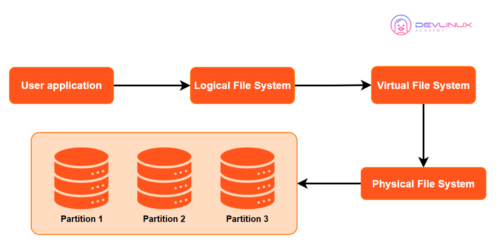
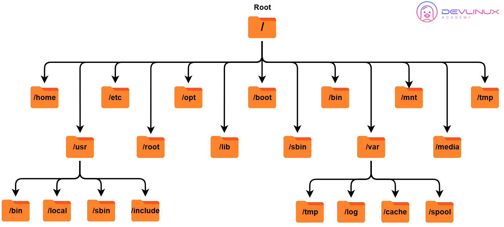
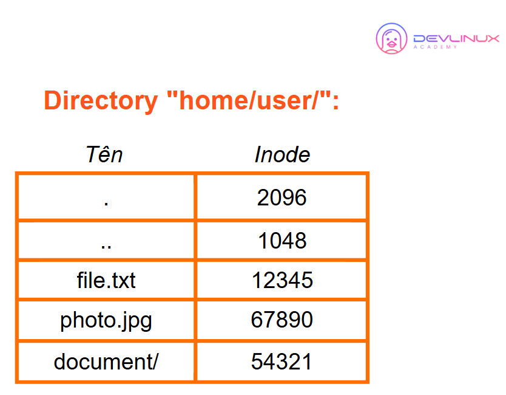
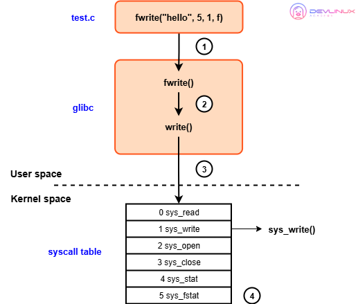
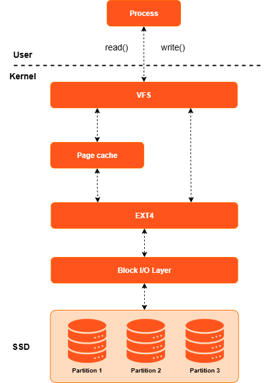
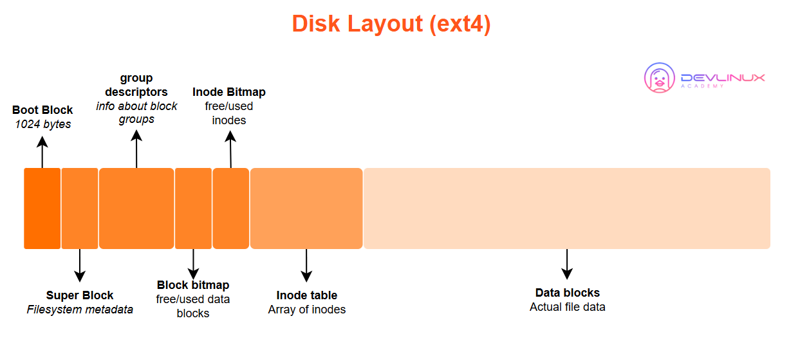
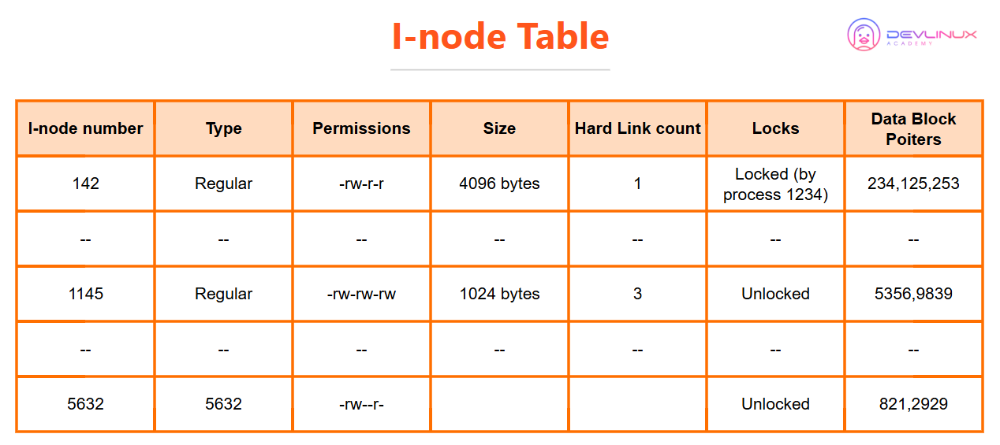
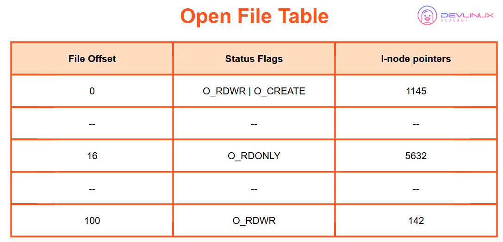
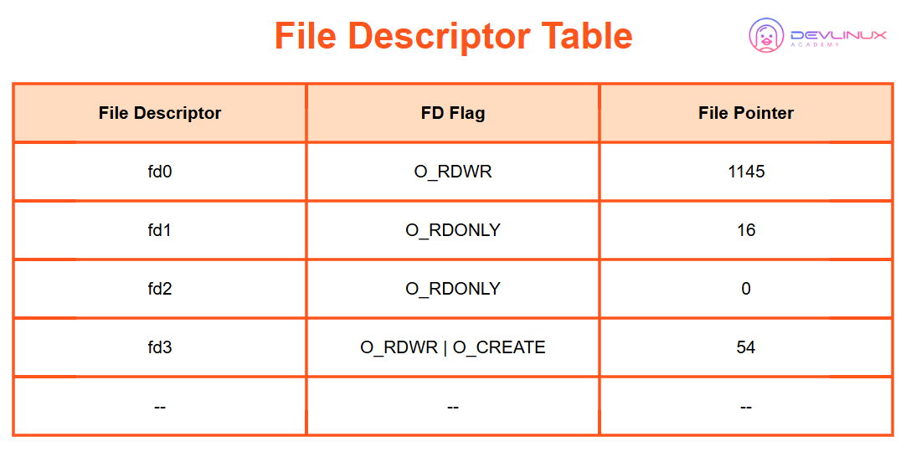
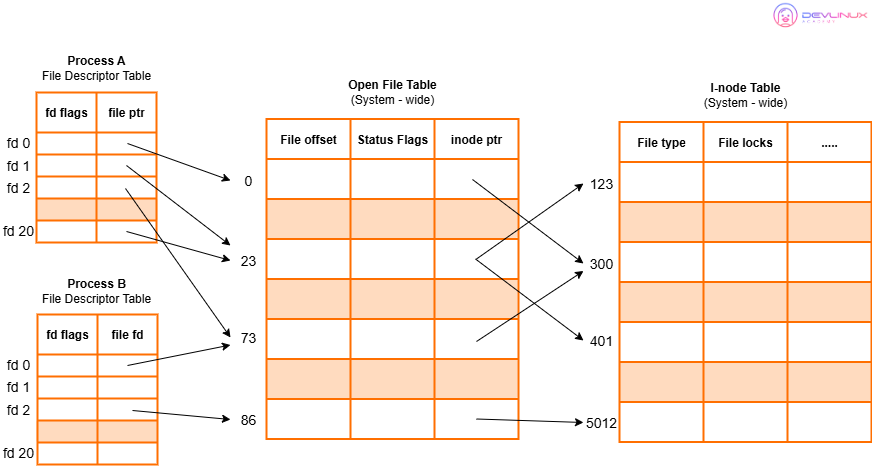

# Embedded Linux - Linux File System

> Tài liệu học về Linux File System: File System Concepts, File Operations, File Management và File Locking

---

## 📑 Mục Lục

### [1. Introduction](#1-introduction)
- [1.1. Khái niệm chung](#11-khái-niệm-chung)
  - [1.1.1. Linux File System](#111-linux-file-system)
  - [1.1.2. Linux File System Structure](#112-linux-file-system-structure)
  - [1.1.3. Filesystem Hierarchy Standard (FHS)](#113-filesystem-hierarchy-standard-fhs)
  - [1.1.4. Directory và Inode](#114-directory-và-inode)
  - [1.1.5. File Types](#115-file-types)

### [2. Operations on File](#2-operations-on-file)
- [2.1. System Call Functions](#21-system-call-functions)

### [3. File Management](#3-file-management)
- [3.1. Page Cache](#31-page-cache)
- [3.2. I-node Table](#32-i-node-table)
- [3.3. Open File Table](#33-open-file-table)
- [3.4. File Descriptor Table](#34-file-descriptor-table)
- [3.5. File Opening Process](#35-file-opening-process)

### [4. File Locking](#4-file-locking)
- [4.1. File Locking Concepts](#41-file-locking-concepts)
- [4.2. flock() - BSD-style locking](#42-flock---bsd-style-locking)
- [4.3. fcntl() - POSIX-style locking](#43-fcntl---posix-style-locking)

---

# 1. Introduction

## 1.1. Khái niệm chung

### 1.1.1. Linux File System

**File System** là một phương pháp tổ chức và quản lý dữ liệu trên thiết bị lưu trữ (hard drive, SSD, USB, etc.). Nó định nghĩa cách dữ liệu được lưu trữ, truy xuất, và tổ chức.

- **Ví dụ minh họa:** Nó như một thư viện. Nếu hàng nghìn cuốn sách nằm rải rác khắp nơi, việc tìm một cuốn sẽ rất khó khăn. Nhưng trong một cấu trúc có tổ chức, như các kệ sách được dán nhãn, việc tìm kiếm một cuốn sách trở nên dễ dàng.

**Linux File System** là tập hợp các cơ chế chịu trách nhiệm kiểm soát cách thức, vị trí và thời điểm dữ liệu được lưu trữ hoặc được truy xuất từ các thiết bị lưu trữ. Hệ thống này quản lý dữ liệu một cách có cấu trúc trên các ổ đĩa hoặc phân vùng, và mỗi phân vùng trong Linux đều sở hữu hệ thống tệp riêng. Điều này xuất phát từ nguyên lý rằng Linux xem mọi đối tượng trong hệ thống—bao gồm cả thiết bị và ứng dụng—như một tệp

#### Chức năng chính:

1. **Tổ chức dữ liệu**: Cấu trúc hierarchical (cây thư mục)
2. **Metadata management**: Lưu trữ thông tin về files (tên, kích thước, permissions, timestamps)
3. **Storage allocation**: Quản lý không gian lưu trữ (blocks/clusters)
4. **Access control**: Quản lý quyền truy cập files
5. **Data integrity**: Đảm bảo tính toàn vẹn dữ liệu

#### Các loại File System phổ biến trong Linux:

| File System     | Đặc điểm                                               | Ứng dụng                      |
| --------------- | ------------------------------------------------------ | ----------------------------- |
| **ext4**        | Mặc định cho nhiều Linux distros, journaling, reliable | Desktop/Server Linux          |
| **ext3/ext2**   | Phiên bản cũ hơn của ext4                              | Legacy systems                |
| **XFS**         | High performance, scalable, large files                | Enterprise servers            |
| **Btrfs**       | Modern, CoW, snapshots, compression                    | Advanced use cases            |
| **F2FS**        | Flash-Friendly, tối ưu cho SSD/eMMC                    | Embedded systems, smartphones |
| **JFFS2/UBIFS** | Dành cho flash memory (NAND/NOR)                       | Embedded devices              |
| **FAT32/exFAT** | Simple, cross-platform                                 | USB drives, SD cards          |
| **NTFS**        | Windows file system                                    | Dual-boot systems             |

#### File System cho Embedded Linux:

Trong Embedded Linux, việc chọn file system phụ thuộc vào:
- **Storage type**: NAND flash, NOR flash, eMMC, SD card
- **Memory constraints**: RAM/ROM limitations
- **Reliability requirements**: Power-loss protection
- **Performance needs**: Read/write speed

```
Embedded Storage Types:
├── NAND Flash → UBIFS, JFFS2
├── NOR Flash → JFFS2
├── eMMC/SD → ext4, F2FS
├── RAM → tmpfs, ramfs
└── Read-only → squashfs
```

### 1.1.2. Linux File System Structure



**Kiến trúc của một hệ thống tệp bao gồm ba lớp chính, mỗi lớp đảm nhiệm một tầng trừu tượng hóa khác nhau:**

```
User Application (open/read/write)
        │
        ▼
┌───────────────────────────────────────┐
│  1. LOGICAL FILE SYSTEM (LFS)         │
│  ├─ System call handling              │
│  ├─ Pathname resolution               │
│  ├─ File descriptor management        │
│  └─ Permission & lock checking        │
├───────────────────────────────────────┤
│  2. VIRTUAL FILE SYSTEM (VFS)         │
│  ├─ 4 objects: superblock, inode,     │
│  │   dentry, file                     │
│  ├─ Operations tables (polymorphism)  │
│  ├─ Dentry cache (DCACHE)             │
│  └─ Mount management                  │
├───────────────────────────────────────┤
│  3. PHYSICAL FILE SYSTEM (PFS)        │
│  ├─ ext4 / XFS / FAT32 / UBIFS ...    │
│  ├─ Disk layout & block allocation    │
│  ├─ Journaling (JBD2)                 │
│  └─ Block I/O layer → Device driver   │
└───────────────────────────────────────┘
                                        │
                                        ▼
                               Hardware (SSD/HDD/eMMC)
```

**1. Hệ thống tệp logic (Logical File System)**

Lớp này là **tầng interface giữa user space và kernel**, hoạt động như "cửa ngõ" để các ứng dụng làm việc với tệp. Tuy nhiên, nó không chỉ đơn thuần chuyển tiếp yêu cầu — nó thực hiện nhiều tác vụ phức tạp:

- **Xử lý system call**: Khi app gọi `open()`, `read()`, `write()`, LFS tiếp nhận qua các handler như `sys_open()`, `sys_read()` trong kernel. Đây là điểm chuyển đổi từ user space sang kernel space.

- **Pathname resolution**: Phân giải đường dẫn như `/home/user/file.txt` thành inode number. Quá trình này đi từng bước: root (`/`) → `home` → `user` → `file.txt`, kiểm tra quyền truy cập ở mỗi bước và xử lý symlink (đệ quy tối đa 40 lần).

- **Quản lý File Descriptor (FD)**: Duy trì bảng FD riêng cho mỗi process (trong `struct files_struct`). FD là số nguyên (0=stdin, 1=stdout, 2=stderr), đóng vai trò "tay cầm" để process thao tác với file mà không cần biết chi tiết bên trong kernel.

- **Quản lý file offset**: Mỗi lần `open()` tạo một `struct file` riêng với offset (`f_pos`) độc lập — đó là lý do hai lần `open()` cùng file có hai offset khác nhau, nhưng `dup()` và `fork()` lại chia sẻ chung offset.

- **Kiểm tra locking**: Trước khi cho phép I/O, LFS kiểm tra các advisory/mandatory locks (`flock()`, `fcntl()`) để tránh race condition.

> **Nói ngắn gọn**: LFS là lớp làm việc với **khái niệm file trừu tượng** — nó không quan tâm dữ liệu nằm ở block nào trên ổ cứng, chỉ xử lý pathname, FD, permission, và lock semantics.

**2. Hệ thống tệp ảo (Virtual File System – VFS)**

VFS là **lớp abstraction trung tâm của toàn bộ hệ thống file Linux**, cung cấp một interface chung để mọi filesystem đều có thể "cắm" vào được. Nó định nghĩa **bốn đối tượng cốt lõi**:

| Đối tượng | Vai trò | Ví dụ |
|-----------|---------|-------|
| **super_block** | Đại diện một filesystem đã mount | ext4 superblock trên `/dev/sda1` |
| **inode** | Đại diện một file/directory (lưu metadata) | File `file.txt` có inode #12345 |
| **dentry** | Đại diện một **tên** trong directory | Entry `"file.txt" → inode #12345` |
| **file** | Đại diện một file **đang mở** | FD 3 trỏ đến struct file |

**Cơ chế hoạt động — Operations Tables (Polymorphism)**

```c
// VFS định nghĩa interface, mỗi filesystem tự implement:
struct file_operations {
    ssize_t (*read)(struct file *, char __user *, size_t, loff_t *);
    ssize_t (*write)(struct file *, const char __user *, size_t, loff_t *);
    int     (*open)(struct inode *, struct file *);
    int     (*release)(struct inode *, struct file *);
    // ...
};
```

Khi app gọi `read()`, luồng đi như sau:
```
read(fd, buf, n)
  → sys_read()                (LFS)
    → vfs_read()              (VFS)
      → file->f_op->read()    (VFS gọi ext4_readpage hoặc fat_read...)
```

Nhờ cơ chế này, **kernel không cần biết đang làm việc với filesystem nào** — nó chỉ việc gọi con trỏ hàm trong operations table. Đây là bản chất của "đa hình" (polymorphism) được hiện thực bằng C.

**Dentry Cache (DCACHE)**

VFS duy trì một bộ nhớ đệm các dentry đã từng truy cập:
- Khi lookup pathname, VFS hash `(parent_inode, name)` và tìm trong dcache trước
- **Cache hit**: dùng ngay, không cần đọc disk → rất nhanh
- **Cache miss**: xuống filesystem đọc disk, tạo dentry mới, đưa vào cache
- Khi thiếu memory, dcache được shrink (thu hồi) bằng LRU

**Mount Management**

VFS hỗ trợ nhiều filesystem hoạt động đồng thời thông qua cơ chế mount:
- Mỗi lần `mount -t ext4 /dev/sda1 /mnt`, VFS tạo một `struct mount` mới
- Các dentry tại mount point được "che" bởi dentry của filesystem được mount
- Điều này cho phép `/mnt/usb` trỏ sang super_block của USB trong khi `/` vẫn là ext4

> **Nói ngắn gọn**: VFS là "bộ chuyển đổi đa năng" — app chỉ cần nói "đọc file này", VFS tự tìm đúng filesystem và gọi hàm tương ứng, dù file nằm trên ext4, FAT32, NFS, hay FUSE.

**3. Hệ thống tệp vật lý (Physical File System)**

Đây là lớp **làm việc trực tiếp với phần cứng**, implement các cấu trúc dữ liệu trên disk và thuật toán quản lý block. Mỗi filesystem có cách tổ chức riêng:

**Ví dụ — ext4 Disk Layout:**

```
Block Group 0:
┌─────────────────────────────┐
│ Superblock (1KB)            │ ← Magic 0xEF53, block count, state...
├─────────────────────────────┤
│ Group Descriptors           │ ← Mô tả tất cả block groups
├─────────────────────────────┤
│ Block Bitmap (1 block)      │ ← Block nào đã dùng/còn trống
├─────────────────────────────┤
│ Inode Bitmap (1 block)      │ ← Inode nào đã dùng/còn trống
├─────────────────────────────┤
│ Inode Table (N blocks)      │ ← Mảng inodes (256 bytes mỗi inode)
├─────────────────────────────┤
│ Data Blocks                 │ ← Nội dung file và directory entries
└─────────────────────────────┘
```

**Cơ chế quan trọng:**

- **Extents (ext4)**: Thay vì lưu từng block riêng lẻ (indirect blocks kiểu cũ), ext4 dùng extent — một cặp `(logical_start, length, physical_start)` ánh xạ một khoảng block liên tục. Một extent có thể map tới 128MB dữ liệu (với block 4K). Điều này giúp giảm hàng ngàn con trỏ block thành chỉ vài extents.

- **Journaling (JBD2)**: Mọi thao tác ghi đều được ghi vào journal trước, sau đó mới ghi vào vị trí thật (write-ahead logging). Nếu crash giữa chừng, kernel replay journal khi mount lại → đảm bảo **atomicity** và **consistency** của filesystem (tính toàn vẹn dữ liệu).

- **HTree cho thư mục lớn**: Thư mục có nhiều file được tổ chức dạng B-tree (hash tree) thay vì linear list → tìm file trong thư mục 10,000 entries chỉ mất O(log N).

- **Block I/O Layer**: PFS không ghi trực tiếp vào ổ cứng. Nó tạo các **BIO request** (Block I/O) và gửi xuống Block Layer, nơi có I/O scheduler (CFQ/deadline/mq-deadline) thực hiện merge và sắp xếp yêu cầu trước khi gửi xuống device driver.

> **Nói ngắn gọn**: PFS là phần "cơ bắp" — nó biết chính xác cách sắp xếp bit và byte trên ổ cứng, tối ưu cho từng loại thiết bị (HDD, SSD, NAND flash) và đảm bảo dữ liệu không bị hỏng khi mất điện.

**Tóm tắt ba lớp:**

| Lớp | Trách nhiệm chính | Dữ liệu quản lý | Interface với |
|-----|-------------------|-----------------|---------------|
| **LFS** | System call, pathname, FD, permission | `struct file`, `task_struct->files` | User space (app) |
| **VFS** | Abstraction, 4 objects, dcache, mount | super_block, inode, dentry, file | Mọi filesystem |
| **PFS** | Disk layout, block allocation, journaling | ext4_inode, extent tree, block bitmap | Block device (driver) |

### 1.1.3. Filesystem Hierarchy Standard (FHS)

**FHS (Filesystem Hierarchy Standard)** là tiêu chuẩn định nghĩa cấu trúc thư mục trong các hệ điều hành Unix/Linux.




#### Chức năng cơ bản các thư mục trong FHS:
```
/                          # Root directory
├── bin/                   # Essential user binaries (ls, cat, cp)
├── sbin/                  # System binaries (fsck, init, reboot)
├── etc/                   # Configuration files
├── home/                  # User home directories
│   └── username/
├── root/                  # Root user home directory
├── usr/                   # User programs and data
│   ├── bin/               # User binaries
│   ├── sbin/              # System binaries (non-essential)
│   ├── lib/               # Libraries for /usr/bin and /usr/sbin
│   ├── local/             # Locally installed software
│   └── share/             # Architecture-independent data
├── var/                   # Variable data (logs, caches, temp)
│   ├── log/               # Log files
│   ├── tmp/               # Temporary files (persistent across reboots)
│   └── cache/             # Application cache
├── tmp/                   # Temporary files (cleared on reboot)
├── boot/                  # Bootloader files, kernel images
├── dev/                   # Device files
├── proc/                  # Process information (virtual filesystem)
├── sys/                   # System information (virtual filesystem)
├── lib/                   # Essential shared libraries
├── opt/                   # Optional software packages
├── mnt/                   # Temporary mount points
└── media/                 # Removable media mount points
```

#### Chi tiết các thư mục quan trọng:

**`/bin` và `/sbin`:**
- `/bin`: Commands cần thiết cho tất cả users (ls, cat, cp, mv)
- `/sbin`: System administration commands (fsck, reboot, ifconfig)

**`/etc`:**
- Configuration files cho toàn hệ thống
- Ví dụ: `/etc/passwd`, `/etc/fstab`, `/etc/hosts`

**`/dev`:**
- Device files (character and block devices)
- Ví dụ: `/dev/sda`, `/dev/tty`, `/dev/null`

**`/proc` và `/sys`:**
- Virtual filesystems cung cấp thông tin kernel/process
- `/proc/cpuinfo`, `/sys/class/net/`

**`/var`:**
- Variable data thay đổi khi hệ thống chạy
- Logs (`/var/log/`), mail, temporary files

**Embedded Linux FHS:**

Trong embedded systems, FHS có thể được tối giản:
```bash
# BusyBox-based minimal root filesystem
/
├── bin -> /usr/bin        # Symlink to /usr/bin
├── sbin -> /usr/sbin
├── lib -> /usr/lib
├── usr/
│   ├── bin/               # BusyBox và utilities
│   ├── sbin/
│   └── lib/
├── etc/                   # Configs
├── dev/                   # Device nodes (managed by devtmpfs)
├── proc/                  # Virtual FS
├── sys/                   # Virtual FS
└── tmp/                   # Temporary
```

### 1.1.4. Directory và Inode

#### Directory là gì?

**Directory** (thư mục) trong Linux thực chất là một **file đặc biệt** chứa danh sách các file và directory con bên trong nó. Mỗi entry trong directory chứa:
- **Tên file/directory**
- **Inode number** tương ứng

Directory giống như "cuốn danh bạ" ánh xạ tên → inode number.



**Đặc điểm quan trọng:**
- Directory KHÔNG chứa nội dung file, chỉ chứa mapping tên → inode
- Nội dung thực sự nằm trong data blocks được inode quản lý
- Directory cũng có inode riêng (type = directory)

#### Inode là gì?

**Inode (Index Node)** là một cấu trúc dữ liệu trong filesystem lưu trữ metadata về một file hoặc directory. Mỗi file/directory có một inode riêng.

#### Inode chứa thông tin gì?

```c
struct inode {
    mode_t    i_mode;      // File type và permissions
    uid_t     i_uid;       // Owner user ID
    gid_t     i_gid;       // Owner group ID
    off_t     i_size;      // File size (bytes)
    time_t    i_atime;     // Last access time
    time_t    i_mtime;     // Last modification time
    time_t    i_ctime;     // Last status change time
    nlink_t   i_nlink;     // Number of hard links
    blkcnt_t  i_blocks;    // Number of blocks allocated
    blksize_t i_blksize;   // Block size
    dev_t     i_rdev;      // Device ID (if special file)
    ino_t     i_ino;       // Inode number
    // Data block pointers
    __u32     i_block[15]; // Pointers to data blocks
};
```

#### Điểm quan trọng:

❗ **Inode KHÔNG chứa:**
- Tên file (tên file được lưu trong directory entry)
- Nội dung file (được lưu trong data blocks)

✅ **Inode CHỈ chứa:**
- Metadata về file
- Pointers đến data blocks

#### Mối quan hệ giữa Directory và Inode:

```
Directory Entry Structure:
+------------------+
| Inode Number     | → Points to Inode Table
| Entry Length     |
| Name Length      |
| File Type        |
| File Name        |
+------------------+

Example: Directory "/home/user"
+--------+----------+
| Inode# | Name     |
+--------+----------+
| 2      | .        |  # Current dir
| 1048   | ..       |  # Parent dir
| 12345  | file.txt |  # File
| 67890  | photo.jpg|  # File
+--------+----------+
```

**Key Points:**
1. **Tên file chỉ tồn tại trong directory entry**, không có trong inode
2. **Một inode có thể có nhiều tên** (hard links) trong các directory khác nhau
3. **Directory cũng là file**, có inode riêng, data blocks chứa directory entries
4. **Xóa file** = xóa directory entry, giảm link count của inode

#### Xem thông tin Inode:

```bash
# Hiển thị inode numbers
ls -i
# Output: 1234567 file.txt

# Xem chi tiết inode
stat file.txt
# Output:
#   File: file.txt
#   Size: 1024      Blocks: 8       IO Block: 4096
#   Inode: 1234567  Links: 1
#   Access: 2025-12-08 10:00:00
#   Modify: 2025-12-08 09:30:00
#   Change: 2025-12-08 09:30:00

# Tìm file theo inode number
find . -inum 1234567

# Xem số lượng inodes
df -i
```

#### Hard Links và Inode:

```bash
# Tạo file
echo "Hello" > original.txt

# Tạo hard link - cùng inode
ln original.txt hardlink.txt

# Kiểm tra
ls -li
# 1234567 -rw-r--r-- 2 user user 6 ... original.txt
# 1234567 -rw-r--r-- 2 user user 6 ... hardlink.txt
# Cùng inode number (1234567), link count = 2

# Xóa original.txt
rm original.txt
# hardlink.txt vẫn tồn tại vì inode vẫn có link count = 1
```

#### Soft Links (Symbolic Links) và Inode:

```bash
# Tạo symbolic link - inode khác
ln -s original.txt symlink.txt

ls -li
# 1234567 -rw-r--r-- 1 user user 6 ... original.txt
# 7654321 lrwxrwxrwx 1 user user 12 ... symlink.txt -> original.txt
# Khác inode, symlink có type 'l'
```

### 1.1.5. File Types

Linux hỗ trợ nhiều loại file khác nhau. Mỗi loại có ký tự đại diện riêng trong `ls -l`.

#### Các loại file trong Linux:

| Type                  | Symbol | Description                            | Example                |
| --------------------- | ------ | -------------------------------------- | ---------------------- |
| **Regular file**      | `-`    | File thông thường (text, binary, etc.) | `file.txt`             |
| **Directory**         | `d`    | Thư mục                                | `/home/user/`          |
| **Symbolic link**     | `l`    | Liên kết mềm                           | `link -> target`       |
| **Character device**  | `c`    | Thiết bị ký tự (sequential access)     | `/dev/tty`             |
| **Block device**      | `b`    | Thiết bị khối (random access)          | `/dev/sda`             |
| **Socket**            | `s`    | IPC socket                             | `/var/run/docker.sock` |
| **Named pipe (FIFO)** | `p`    | Pipe có tên                            | `/tmp/mypipe`          |

#### Chi tiết từng loại:

**1. Regular File (`-`):**
```bash
-rw-r--r-- 1 user user 1024 Dec 8 10:00 file.txt
# ^ regular file symbol
```
- Text files, binary executables, images, etc.
- Chứa dữ liệu thực tế

**2. Directory (`d`):**
```bash
drwxr-xr-x 2 user user 4096 Dec 8 10:00 mydir
# ^ directory symbol
```
- Contains list of files and subdirectories
- Special file chứa directory entries

**3. Symbolic Link (`l`):**
```bash
lrwxrwxrwx 1 user user 12 Dec 8 10:00 link -> /path/to/target
# ^ symlink symbol
```
- Pointer to another file/directory
- Có thể point đến file không tồn tại (broken link)

**4. Character Device (`c`):**
```bash
crw-rw---- 1 root tty 5, 0 Dec 8 10:00 /dev/tty
# ^ character device
```
- Sequential access devices (keyboard, serial ports)
- Data stream, no random access

**5. Block Device (`b`):**
```bash
brw-rw---- 1 root disk 8, 0 Dec 8 10:00 /dev/sda
# ^ block device
```
- Random access devices (hard drives, USB)
- Data được đọc/ghi theo blocks

**6. Socket (`s`):**
```bash
srwxrwxrwx 1 user user 0 Dec 8 10:00 /tmp/socket
# ^ socket
```
- Inter-process communication (IPC)
- Unix domain sockets

**7. Named Pipe/FIFO (`p`):**
```bash
prw-r--r-- 1 user user 0 Dec 8 10:00 /tmp/mypipe
# ^ named pipe
```
- First-In-First-Out communication
- IPC between processes

#### Kiểm tra file type:

```bash
# Sử dụng ls -l
ls -l /dev/sda
# brw-rw---- 1 root disk 8, 0 Dec  8 10:00 /dev/sda

# Sử dụng file command
file /dev/sda
# /dev/sda: block special (8/0)

file /etc/passwd
# /etc/passwd: ASCII text

# Sử dụng stat
stat -c "%F" /dev/sda
# block special file

# Trong C code
#include <sys/stat.h>

struct stat sb;
stat("/dev/sda", &sb);

if (S_ISREG(sb.st_mode))  // Regular file
if (S_ISDIR(sb.st_mode))  // Directory
if (S_ISLNK(sb.st_mode))  // Symbolic link
if (S_ISCHR(sb.st_mode))  // Character device
if (S_ISBLK(sb.st_mode))  // Block device
if (S_ISSOCK(sb.st_mode)) // Socket
if (S_ISFIFO(sb.st_mode)) // FIFO/pipe
```

#### Tạo các loại file:

```bash
# Regular file
touch file.txt
echo "content" > file.txt

# Directory
mkdir mydir

# Symbolic link
ln -s target.txt symlink.txt

# Named pipe
mkfifo mypipe

# Character device (cần root)
mknod /dev/mychar c 234 0

# Block device (cần root)
mknod /dev/myblock b 234 0
```

---

# 2. Operations on File

**System calls** là interface giữa user space và kernel space để thực hiện các thao tác với files. Khác với C standard library functions (fopen, fread), system calls tương tác trực tiếp với kernel.

**System call process** được diễn ra như sau:



- **Hàm `fwrite`, cùng với các thành phần còn lại của thư viện C, được triển khai trong glibc**, một trong những thành phần cốt lõi của hệ điều hành Linux.
- `fwrite` về bản chất là một wrapper cho lời gọi thư viện `write`.
- **`write` sẽ load các system call ID (đối với `write` là 1) và các tham số vào các thanh ghi của bộ xử lý**, sau đó yêu cầu bộ xử lý chuyển sang kernel level.
    
    Cách thức thực hiện phụ thuộc vào kiến trúc bộ xử lý và đôi khi cả vào từng dòng bộ xử lý cụ thể.
    
    Ví dụ: các bộ xử lý x86 thường sử dụng ngắt 80, trong khi các bộ xử lý x64 sử dụng lệnh `syscall`.
    
- **Khi bộ xử lý đang thực thi trong kernel space, nó sẽ đưa mã định danh system call vào bảng syscall, truy xuất con trỏ hàm tại offset 1 và gọi hàm tương ứng.**
    
    Hàm này — `sys_write` — chính là phần hiện thực trong nhân Linux dành cho thao tác ghi tệp.

## 2.1. System Call Functions

| System Call | Prototype                                              | Description                     |
| ----------- | ------------------------------------------------------ | ------------------------------- |
| `open()`    | `int open(const char *path, int flags, mode_t mode)`   | Mở file, trả về file descriptor |
| `close()`   | `int close(int fd)`                                    | Đóng file descriptor            |
| `read()`    | `ssize_t read(int fd, void *buf, size_t count)`        | Đọc dữ liệu từ file             |
| `write()`   | `ssize_t write(int fd, const void *buf, size_t count)` | Ghi dữ liệu vào file            |
| `lseek()`   | `off_t lseek(int fd, off_t offset, int whence)`        | Di chuyển file pointer          |
| `stat()`    | `int stat(const char *path, struct stat *buf)`         | Lấy thông tin file              |
| `fstat()`   | `int fstat(int fd, struct stat *buf)`                  | Lấy thông tin từ fd             |
| `fcntl()`   | `int fcntl(int fd, int cmd, ...)`                      | File control operations         |
| `ioctl()`   | `int ioctl(int fd, unsigned long request, ...)`        | Device control                  |

### 1. open() - Mở file

```c
#include <fcntl.h>
#include <sys/stat.h>

int open(const char *pathname, int flags);
int open(const char *pathname, int flags, mode_t mode);
```

**Flags (bắt buộc chọn 1):**
- `O_RDONLY`: Read only
- `O_WRONLY`: Write only
- `O_RDWR`: Read and write

**Flags bổ sung (optional):**
- `O_CREAT`: Tạo file nếu không tồn tại (cần mode)
- `O_TRUNC`: Truncate file về 0 bytes nếu đã tồn tại
- `O_APPEND`: Append mode (ghi vào cuối file)
- `O_EXCL`: Fail if file exists (dùng với O_CREAT)
- `O_NONBLOCK`: Non-blocking mode
- `O_SYNC`: Synchronous writes

**Mode (permissions khi tạo file mới):**
```c
S_IRUSR  // User read     (0400)
S_IWUSR  // User write    (0200)
S_IXUSR  // User execute  (0100)
S_IRGRP  // Group read    (0040)
S_IWGRP  // Group write   (0020)
S_IXGRP  // Group execute (0010)
S_IROTH  // Others read   (0004)
S_IWOTH  // Others write  (0002)
S_IXOTH  // Others execute(0001)
```

**Ví dụ:**
```c
#include <fcntl.h>
#include <stdio.h>
#include <unistd.h>

int main() {
    int fd;
    
    // Mở file để đọc
    fd = open("/etc/passwd", O_RDONLY);
    if (fd == -1) {
        perror("open");
        return 1;
    }
    
    // Tạo file mới với permissions 0644 (rw-r--r--)
    fd = open("newfile.txt", O_CREAT | O_WRONLY | O_TRUNC, 
              S_IRUSR | S_IWUSR | S_IRGRP | S_IROTH);
    if (fd == -1) {
        perror("open");
        return 1;
    }
    
    // Mở trong append mode
    fd = open("log.txt", O_WRONLY | O_APPEND | O_CREAT, 0644);
    
    close(fd);
    return 0;
}
```

### 2. read() - Đọc dữ liệu

```c
#include <unistd.h>

ssize_t read(int fd, void *buf, size_t count);
```

**Return value:**
- `> 0`: Số bytes đã đọc
- `0`: End of file (EOF)
- `-1`: Error

**Ví dụ:**
```c
#include <fcntl.h>
#include <unistd.h>
#include <stdio.h>

#define BUFFER_SIZE 1024

int main() {
    int fd;
    char buffer[BUFFER_SIZE];
    ssize_t bytes_read;
    
    fd = open("file.txt", O_RDONLY);
    if (fd == -1) {
        perror("open");
        return 1;
    }
    
    // Đọc tối đa BUFFER_SIZE bytes
    bytes_read = read(fd, buffer, BUFFER_SIZE);
    if (bytes_read == -1) {
        perror("read");
        close(fd);
        return 1;
    }
    
    printf("Read %zd bytes\n", bytes_read);
    
    // Đọc toàn bộ file
    while ((bytes_read = read(fd, buffer, sizeof(buffer))) > 0) {
        write(STDOUT_FILENO, buffer, bytes_read);
    }
    
    close(fd);
    return 0;
}
```

### 3. write() - Ghi dữ liệu

```c
#include <unistd.h>

ssize_t write(int fd, const void *buf, size_t count);
```

**Return value:**
- `>= 0`: Số bytes đã ghi
- `-1`: Error

**Ví dụ:**
```c
#include <fcntl.h>
#include <unistd.h>
#include <string.h>

int main() {
    int fd;
    const char *msg = "Hello, Linux!\n";
    ssize_t bytes_written;
    
    fd = open("output.txt", O_WRONLY | O_CREAT | O_TRUNC, 0644);
    if (fd == -1) {
        perror("open");
        return 1;
    }
    
    bytes_written = write(fd, msg, strlen(msg));
    if (bytes_written == -1) {
        perror("write");
        close(fd);
        return 1;
    }
    
    printf("Wrote %zd bytes\n", bytes_written);
    
    close(fd);
    return 0;
}
```

### 4. lseek() - Di chuyển file pointer

```c
#include <unistd.h>

off_t lseek(int fd, off_t offset, int whence);
```

**Whence values:**
- `SEEK_SET`: Từ đầu file (offset là vị trí tuyệt đối)
- `SEEK_CUR`: Từ vị trí hiện tại
- `SEEK_END`: Từ cuối file

**Ví dụ:**
```c
#include <fcntl.h>
#include <unistd.h>
#include <stdio.h>

int main() {
    int fd;
    off_t pos;
    char buffer[10];
    
    fd = open("file.txt", O_RDONLY);
    
    // Lấy vị trí hiện tại
    pos = lseek(fd, 0, SEEK_CUR);
    printf("Current position: %ld\n", pos);
    
    // Di chuyển đến byte thứ 100
    lseek(fd, 100, SEEK_SET);
    
    // Lùi 10 bytes
    lseek(fd, -10, SEEK_CUR);
    
    // Di chuyển đến cuối file
    off_t file_size = lseek(fd, 0, SEEK_END);
    printf("File size: %ld bytes\n", file_size);
    
    // Quay về đầu file
    lseek(fd, 0, SEEK_SET);
    read(fd, buffer, 10);
    
    close(fd);
    return 0;
}
```

### 5. stat(), fstat(), lstat() - Lấy thông tin file

```c
#include <sys/stat.h>

int stat(const char *pathname, struct stat *statbuf);
int fstat(int fd, struct stat *statbuf);
int lstat(const char *pathname, struct stat *statbuf);
```

**struct stat:**
```c
struct stat {
    dev_t     st_dev;         // Device ID
    ino_t     st_ino;         // Inode number
    mode_t    st_mode;        // File type & permissions
    nlink_t   st_nlink;       // Number of hard links
    uid_t     st_uid;         // User ID
    gid_t     st_gid;         // Group ID
    dev_t     st_rdev;        // Device ID (if special file)
    off_t     st_size;        // Total size (bytes)
    blksize_t st_blksize;     // Block size
    blkcnt_t  st_blocks;      // Number of 512B blocks
    time_t    st_atime;       // Last access time
    time_t    st_mtime;       // Last modification time
    time_t    st_ctime;       // Last status change time
};
```

**Ví dụ:**
```c
#include <sys/stat.h>
#include <stdio.h>
#include <time.h>

int main() {
    struct stat sb;
    
    if (stat("file.txt", &sb) == -1) {
        perror("stat");
        return 1;
    }
    
    printf("File size: %ld bytes\n", sb.st_size);
    printf("Inode: %lu\n", sb.st_ino);
    printf("Links: %lu\n", sb.st_nlink);
    printf("Permissions: %o\n", sb.st_mode & 0777);
    
    // Kiểm tra file type
    if (S_ISREG(sb.st_mode))  printf("Regular file\n");
    if (S_ISDIR(sb.st_mode))  printf("Directory\n");
    if (S_ISLNK(sb.st_mode))  printf("Symbolic link\n");
    
    // Timestamps
    printf("Last modified: %s", ctime(&sb.st_mtime));
    
    return 0;
}
```

### Complete Example: File Copy Program

```c
#include <fcntl.h>
#include <unistd.h>
#include <stdio.h>
#include <stdlib.h>

#define BUFFER_SIZE 4096

int main(int argc, char *argv[]) {
    int src_fd, dst_fd;
    ssize_t bytes_read, bytes_written;
    char buffer[BUFFER_SIZE];
    
    if (argc != 3) {
        fprintf(stderr, "Usage: %s <source> <dest>\n", argv[0]);
        return 1;
    }
    
    // Open source file
    src_fd = open(argv[1], O_RDONLY);
    if (src_fd == -1) {
        perror("open source");
        return 1;
    }
    
    // Create destination file
    dst_fd = open(argv[2], O_WRONLY | O_CREAT | O_TRUNC, 0644);
    if (dst_fd == -1) {
        perror("open dest");
        close(src_fd);
        return 1;
    }
    
    // Copy data
    while ((bytes_read = read(src_fd, buffer, BUFFER_SIZE)) > 0) {
        bytes_written = write(dst_fd, buffer, bytes_read);
        if (bytes_written != bytes_read) {
            perror("write");
            break;
        }
    }
    
    if (bytes_read == -1) {
        perror("read");
    }
    
    close(src_fd);
    close(dst_fd);
    
    return 0;
}
```

---

# 3. File Management

Linux quản lý file qua nhiều lớp khác nhau, mỗi lớp giữ một nhiệm vụ riêng. Khi hiểu rõ cách chúng phối hợp, bạn sẽ hiểu vì sao Linux đọc file nhanh, làm việc với nhiều process cùng một lúc và quản lý I/O hiệu quả.

| Lớp                       | Quy mô          | Vai trò                                   |
| ------------------------- | --------------- | ----------------------------------------- |
| **Page Cache**            | RAM             | Cache dữ liệu file để tăng tốc I/O        |
| **Inode Table**           | Disk            | Lưu metadata file (size, perms, block...) |
| **Open File Table**       | Kernel (global) | Theo dõi file đang mở (offset, mode...)   |
| **File Descriptor Table** | Per-process     | Mapping FD → Open File Entry              |

Tất cả phối hợp với nhau để thực hiện thao tác đọc/ghi file.

## 3.1. Page Cache  

**Page Cache** là vùng RAM mà Linux dùng để lưu tạm dữ liệu từ ổ đĩa đã đọc hoặc chuẩn bị ghi.

### Chức năng:

1. **Read caching**: Lưu dữ liệu đã đọc từ disk
2. **Write buffering**: Buffer dữ liệu ghi trước khi flush xuống disk
3. **Read-ahead**: Đọc trước dữ liệu có thể cần thiết
4. **Write-back**: Ghi dữ liệu theo batch để tối ưu



### Nguyên lý hoạt động:

Page Cache là lớp đệm trong RAM giúp tăng tốc đọc/ghi file, tránh phải chạm vào SSD mỗi lần.

Trong sơ đồ, nó nằm giữa VFS và EXT4, nghĩa là mọi truy cập file đều phải đi qua nó.

#### 📥 1. Khi chương trình gọi read() – quá trình đọc file

Khi process gọi:

```c
read(fd, buf, size);
```

Luồng hoạt động như sau:

**👉 Step 1 — Process → VFS**

Process thực hiện `read()`, lời gọi này đi xuống VFS (Virtual File System).

VFS không biết file nằm trên ext4 hay FAT32; nó chỉ quản lý chung.

**👉 Step 2 — VFS kiểm tra Page Cache**

VFS hỏi Page Cache: *"Dữ liệu của file này đã nằm trong RAM chưa?"*

Có 2 trường hợp:

**🟢 Trường hợp 1 — Cache Hit (dữ liệu đã có trong RAM)**

Nếu page cache đã chứa dữ liệu của file đó:
- Dữ liệu được copy từ RAM sang buffer của process
- Không đụng tới ổ SSD
- Tốc độ rất nhanh (RAM nhanh gấp hàng trăm lần SSD)

⟹ Đây là lý do Linux đọc file siêu nhanh sau lần đầu tiên.

**🔴 Trường hợp 2 — Cache Miss (RAM chưa có dữ liệu)**

Nếu page cache không có page cần đọc:
1. VFS chuyển yêu cầu xuống EXT4.
2. EXT4 tính toán block vật lý cần đọc từ SSD.
3. EXT4 gửi yêu cầu cho Block I/O layer.
4. SSD trả dữ liệu về.
5. EXT4 đưa dữ liệu vào Page Cache (lưu vào RAM).
6. VFS copy dữ liệu từ Page Cache → trả về cho process.

⟹ Sau lần đọc đầu tiên, dữ liệu ở RAM → đọc nhanh hơn nhiều lần.

#### 📤 2. Khi chương trình gọi write() – quá trình ghi file

Khi process gọi:

```c
write(fd, buf, size);
```

Luồng hoạt động đảo chiều:

**Step 1 — Process gửi dữ liệu qua VFS**

VFS nhận dữ liệu cần ghi.

**Step 2 — VFS ghi vào Page Cache trước**

Dữ liệu không được ghi thẳng xuống SSD.

Thay vào đó:
- Dữ liệu được ghi vào Page Cache (RAM),
- Page được đánh dấu là **dirty page** (chưa đồng bộ xuống ổ đĩa).

⟹ Điều này giúp ghi file rất nhanh vì dùng tốc độ RAM.

**Step 3 — Kernel ghi xuống SSD sau (write-back)**

EXT4 & Block I/O Layer sẽ thực hiện "ghi thật" xuống SSD theo cơ chế nền:
- Ghi khi cache đầy,
- Hoặc khi kernel chạy flusher,
- Hoặc khi `fsync()` được gọi.

⟹ SSD ít bị ghi → tăng tuổi thọ SSD.

### Ví dụ minh họa:

```c
// Lần đọc đầu tiên - slow (từ disk)
int fd = open("large_file.txt", O_RDONLY);
read(fd, buffer, 1024);  // ~10ms (disk I/O)
close(fd);

// Lần đọc thứ hai - fast (từ page cache)
fd = open("large_file.txt", O_RDONLY);
read(fd, buffer, 1024);  // ~0.1ms (từ RAM)
close(fd);
```

### Xem thông tin Page Cache:

```bash
# Kiểm tra memory usage
free -h
#               total   used   free   shared   buff/cache   available
# Mem:          15Gi    2.3Gi  8.1Gi  524Mi    5.4Gi        12Gi

# /proc/meminfo
cat /proc/meminfo | grep -i cache
# Cached:        5242880 kB
# SwapCached:    0 kB

# Clear page cache (cần root)
sync
echo 3 > /proc/sys/vm/drop_caches
```

### Cache synchronization:

```c
#include <unistd.h>

// Sync tất cả buffers xuống disk
sync();

// Sync một file cụ thể
int fd = open("file.txt", O_WRONLY);
write(fd, data, size);
fsync(fd);     // Đảm bảo data đã ghi xuống disk
close(fd);

// Sync chỉ data, không sync metadata
fdatasync(fd);
```

## 3.2. Inode Table

**I-node Table** là một cấu trúc dữ liệu trong filesystem lưu trữ tất cả các inodes. Mỗi filesystem có một inode table riêng.

### Vị trí trong Filesystem:



### Cấu trúc:

```c
// Mỗi inode có kích thước cố định (thường 256 bytes trong ext4)
Inode Table = Array of Inodes

Inode[0]     // Reserved
Inode[1]     // Lost+found directory
Inode[2]     // Root directory (/)
Inode[3]     // User file
Inode[4]     // User file
...
Inode[N]     // Last inode
```



### Xem thông tin Inode Table:

```bash
# Xem số lượng inodes trong filesystem
df -i
# Filesystem      Inodes  IUsed   IFree  IUse%
# /dev/sda1      6553600  123456 6430144    2%

# Xem thông tin filesystem
tune2fs -l /dev/sda1 | grep -i inode
# Inode count:              6553600
# Free inodes:              6430144
# Inodes per group:         8192
# Inode size:               256

# Xem inode của một file
ls -i file.txt
# 1234567 file.txt

# Debug filesystem
debugfs /dev/sda1
debugfs> stat <1234567>  # Xem chi tiết inode
```

## 3.3. Open File Table

**Open File Table** (hay System-wide File Table) là một bảng duy nhất trong kernel lưu trữ thông tin về tất cả các file đang được mở trong hệ thống.

### Mục đích:

- Theo dõi file position (offset) cho mỗi lần open
- Quản lý file access mode (read/write)
- Reference counting để biết khi nào close file



### Cấu trúc:

```c
// Mỗi entry trong Open File Table chứa:
struct file {
    mode_t f_mode;           // Read/Write mode (O_RDONLY, O_WRONLY, O_RDWR)
    loff_t f_pos;            // Current file position (offset)
    unsigned int f_flags;    // Flags (O_APPEND, O_NONBLOCK, etc.)
    struct inode *f_inode;   // Pointer to inode
    const struct file_operations *f_op;  // File operations
    atomic_t f_count;        // Reference count
    // ... more fields
};
```

## 3.4. File Descriptor Table

**File Descriptor Table** là một bảng riêng cho MỖI process, lưu trữ các file descriptors (FD) của process đó.



### Cấu trúc:

Mỗi process trong Linux có một bảng FD table được quản lý bởi kernel:

```c
// Trong process (task_struct)
struct files_struct {
    struct file *fd_array[NR_OPEN_DEFAULT];  // Array of pointers to Open File Table
    // ...
};
```

**Giải thích:**
- `fd_array[]` là mảng các con trỏ trỏ đến các entry trong **Open File Table**
- Index của mảng chính là **File Descriptor number** (0, 1, 2, 3, ...)
- Mỗi FD số trỏ tới một file đang được mở

### Đặc điểm:

| Đặc điểm               | Mô tả                                                        |
| ---------------------- | ------------------------------------------------------------ |
| **Per-process**        | Mỗi process có FD table riêng, độc lập với process khác      |
| **Index-based**        | FD là số nguyên (0, 1, 2, 3...) dùng làm index vào bảng      |
| **Standard FDs**       | 0 = stdin, 1 = stdout, 2 = stderr (mở sẵn khi process start) |
| **Dynamic allocation** | FD mới được cấp từ số nhỏ nhất còn trống                     |

### Chức năng:

File Descriptor đóng vai trò là **"tay cầm"** (handle) để process thao tác với I/O resources. Các chức năng chính:

**1. Abstraction (Trừu tượng hóa)**
- Che giấu chi tiết phức tạp của kernel (inode, offset, buffer...)
- Process chỉ cần dùng số FD đơn giản (3, 4, 5...) để thao tác

**2. Process Isolation (Cô lập process)**
- FD 3 của process A khác hoàn toàn với FD 3 của process B
- Đảm bảo an toàn và không can thiệp lẫn nhau

**3. Resource Management (Quản lý tài nguyên)**
- Kernel theo dõi file nào đang được mở qua FD
- `close(fd)` giải phóng tài nguyên và FD number
- Giới hạn số lượng FD (`ulimit -n`) để tránh lạm dụng

**4. Redirection & Sharing (Chuyển hướng & Chia sẻ)**
- Redirect I/O: `dup2(file_fd, STDOUT_FILENO)` → ghi vào file thay vì màn hình
- `fork()` kế thừa FD table → parent/child chia sẻ file được mở

### Ví dụ:

```c
int fd1 = open("file.txt", O_RDONLY);  // Returns FD 3
int fd2 = open("file.txt", O_RDWR);    // Returns FD 4

// Process FD Table:
// FD 3 → Open File Entry A → Inode 12345
// FD 4 → Open File Entry B → Inode 12345
// 
// Chú ý: fd1 và fd2 trỏ đến cùng inode nhưng khác Open File Entry
//        → Mỗi FD có offset riêng
```

### Xem File Descriptors:

```bash
# Xem FDs của một process
ls -l /proc/<PID>/fd/
# lrwx------ 1 user user 64 ... 0 -> /dev/pts/0  (stdin)
# lrwx------ 1 user user 64 ... 1 -> /dev/pts/0  (stdout)
# lrwx------ 1 user user 64 ... 2 -> /dev/pts/0  (stderr)
# lrwx------ 1 user user 64 ... 3 -> /home/user/file.txt

# Xem số lượng FDs đang mở
lsof -p <PID>

# Giới hạn FDs
ulimit -n        # Xem limit
ulimit -n 4096   # Set limit
```

## 3.5. File Opening Process

Quá trình mở file liên quan đến 3 cấu trúc dữ liệu chính:

```
1. File Descriptor Table (per-process)
2. Open File Table (system-wide)
3. Inode Table (per-filesystem)
```

### Quy trình chi tiết:

```
Step-by-step khi gọi: int fd = open("/home/user/file.txt", O_RDONLY);

Step 1: VFS (Virtual File System) Layer
├─ Parse pathname "/home/user/file.txt"
├─ Lookup directory entries
│  ├─ / (root) → Inode 2
│  ├─ /home → Inode 1048
│  ├─ /home/user → Inode 2096
│  └─ /home/user/file.txt → Inode 12345
└─ Permission check (read access?)

Step 2: Allocate Open File Table Entry
├─ Create new entry in system-wide Open File Table
├─ Set f_mode = O_RDONLY
├─ Set f_pos = 0 (beginning of file)
├─ Set f_inode = pointer to Inode 12345
└─ Set f_count = 1 (reference count)

Step 3: Allocate File Descriptor
├─ Find lowest available FD in process FD table
│  (0, 1, 2 already used → allocate FD 3)
├─ FD table[3] = pointer to Open File Table entry
└─ Return FD 3 to user space

Step 4: Update Inode
├─ Increment i_count (reference count)
├─ Update atime (access time)
└─ Keep inode in cache
```

### Sơ đồ quan hệ:



### Code example minh họa:

```c
#include <fcntl.h>
#include <unistd.h>
#include <stdio.h>

int main() {
    int fd1, fd2, fd3;
    off_t pos;
    char buf[10];
    
    // Mở file lần 1
    fd1 = open("file.txt", O_RDONLY);
    printf("fd1 = %d\n", fd1);  // Usually 3
    
    // Mở file lần 2 - tạo Open File Entry mới
    fd2 = open("file.txt", O_RDONLY);
    printf("fd2 = %d\n", fd2);  // Usually 4
    
    // Duplicate FD - share cùng Open File Entry
    fd3 = dup(fd1);
    printf("fd3 = %d\n", fd3);  // Usually 5
    
    // fd1 và fd2: khác Open File Entry → khác offset
    read(fd1, buf, 5);  // fd1 offset = 5
    pos = lseek(fd1, 0, SEEK_CUR);
    printf("fd1 offset: %ld\n", pos);  // 5
    
    pos = lseek(fd2, 0, SEEK_CUR);
    printf("fd2 offset: %ld\n", pos);  // 0 (khác entry)
    
    // fd1 và fd3: cùng Open File Entry → cùng offset
    read(fd3, buf, 5);  // Đọc tiếp từ offset 5
    pos = lseek(fd1, 0, SEEK_CUR);
    printf("fd1 offset: %ld\n", pos);  // 10 (shared!)
    
    close(fd1);
    close(fd2);
    close(fd3);
    
    return 0;
}
```

### fork() và File Descriptors:

```c
int fd = open("file.txt", O_RDONLY);

pid_t pid = fork();
if (pid == 0) {
    // Child process
    // FD table được copy, nhưng trỏ đến CÙNG Open File Entry
    read(fd, buf, 10);  // Child đọc 10 bytes
    // Offset của parent cũng thay đổi!
} else {
    // Parent process
    wait(NULL);
    lseek(fd, 0, SEEK_CUR);  // Offset = 10 (do child đã đọc)
}
```

---

# 4. File Locking

## 4.1. File Locking Concepts

**File Locking** là cơ chế đảm bảo rằng nhiều process không đọc/ghi file cùng lúc theo cách gây sai dữ liệu.

Nếu không có locking, bạn rất dễ gặp race condition
→ hai process chạy cùng lúc và ghi đè kết quả của nhau.

### Tại sao cần File Locking?

**Vấn đề không có locking:**
```c
// Process A
read(fd, &balance, sizeof(balance));  // balance = 1000
balance += 500;                        // balance = 1500
// ← Process B đọc balance = 1000 tại đây!
write(fd, &balance, sizeof(balance)); // Ghi 1500

// Process B
read(fd, &balance, sizeof(balance));  // balance = 1000
balance -= 200;                        // balance = 800
write(fd, &balance, sizeof(balance)); // Ghi 800

// Kết quả: balance = 800 (sai! Phải là 1300)
```
**Race condition** xảy ra vì:

- A đọc và sửa file
- B cũng đọc cùng lúc và sửa file dựa trên giá trị cũ
- Kết quả của A bị B ghi đè

Locking giúp ngăn điều này.

### Có hai cách áp dụng khóa trong Linux

1. **Advisory Locking**:
   - Các Processes cần tự kiểm tra và tuân thủ lock
   - Không bắt buộc bởi kernel
   - Dùng `flock()` hoặc `fcntl()`

2. **Mandatory Locking**:
   - Kernel enforce locks
   - Hiếm dùng trong Linux
   - Nếu file bị lock, process khác không thể đọc và ghi
   - Chỉ hoạt động khi filesystem được mount với tùy chọn `mand`


### Các loại khóa trong Linux:

#### Shared vs Exclusive Locks

| Lock Type                       | Symbol    | Description                     | Compatibility                        |
| ------------------------------- | --------- | ------------------------------- | ------------------------------------ |
| **Shared Lock** (Read Lock)     | `LOCK_SH` | Nhiều processes có thể cùng đọc | Shared với Shared                    |
| **Exclusive Lock** (Write Lock) | `LOCK_EX` | Chỉ 1 process được ghi          | Không compatible với bất kỳ lock nào |

**Bảng compatibility:**
```
                                  | Shared    | Exclusive |
                                  | --------- | --------- | --- |
                                  | Shared    | ✓         | ✗   |
                                  | Exclusive | ✗         | ✗   |
```

## 4.2. flock() - BSD-style locking

**flock()** là BSD-style file locking, đơn giản và dễ sử dụng.

### Prototype:

```c
#include <sys/file.h>

int flock(int fd, int operation);
```

### Operations:

- `LOCK_SH`: Shared lock (read lock)
- `LOCK_EX`: Exclusive lock (write lock)
- `LOCK_UN`: Unlock
- `LOCK_NB`: Non-blocking (combine với LOCK_SH hoặc LOCK_EX)

### Đặc điểm:

✅ **Ưu điểm:**
- Đơn giản, dễ sử dụng
- Lock toàn bộ file
- Được inherit qua `fork()`

❌ **Nhược điểm:**
- Không thể lock một phần file
- Không hoạt động trên NFS (một số hệ thống)
- Advisory locking only

### Ví dụ cơ bản:

```c
#include <sys/file.h>
#include <fcntl.h>
#include <stdio.h>
#include <unistd.h>

int main() {
    int fd;
    
    fd = open("data.txt", O_RDWR);
    if (fd == -1) {
        perror("open");
        return 1;
    }
    
    // Acquire exclusive lock (blocking)
    printf("Trying to acquire lock...\n");
    if (flock(fd, LOCK_EX) == -1) {
        perror("flock");
        return 1;
    }
    printf("Lock acquired!\n");
    
    // Critical section
    printf("Working with file...\n");
    sleep(10);  // Simulate work
    
    // Release lock
    flock(fd, LOCK_UN);
    printf("Lock released\n");
    
    close(fd);  // close() cũng tự động release lock
    return 0;
}
```

### Non-blocking lock:

```c
#include <sys/file.h>
#include <fcntl.h>
#include <errno.h>
#include <stdio.h>

int main() {
    int fd = open("data.txt", O_RDWR);
    
    // Try to acquire lock without blocking
    if (flock(fd, LOCK_EX | LOCK_NB) == -1) {
        if (errno == EWOULDBLOCK) {
            printf("File is locked by another process\n");
            return 1;
        }
        perror("flock");
        return 1;
    }
    
    printf("Lock acquired successfully\n");
    
    // Work...
    
    flock(fd, LOCK_UN);
    close(fd);
    return 0;
}
```

### Shared lock example:

```c
// Reader process (nhiều readers có thể cùng chạy)
int fd = open("data.txt", O_RDONLY);
flock(fd, LOCK_SH);  // Shared lock

char buffer[1024];
read(fd, buffer, sizeof(buffer));
printf("Data: %s\n", buffer);

flock(fd, LOCK_UN);
close(fd);

// Writer process (chỉ 1 writer)
int fd = open("data.txt", O_WRONLY);
flock(fd, LOCK_EX);  // Exclusive lock

write(fd, "New data", 8);

flock(fd, LOCK_UN);
close(fd);
```

## 4.3. fcntl() - POSIX-style locking

**fcntl()** cung cấp POSIX-style locking với khả năng lock từng phần của file (record locking).

### Prototype:

```c
#include <fcntl.h>

int fcntl(int fd, int cmd, struct flock *lock);
```

### Commands:

- `F_SETLK`: Set lock (non-blocking)
- `F_SETLKW`: Set lock (blocking, wait)
- `F_GETLK`: Get lock information

### struct flock:

```c
struct flock {
    short l_type;    // Lock type: F_RDLCK, F_WRLCK, F_UNLCK
    short l_whence;  // Starting point: SEEK_SET, SEEK_CUR, SEEK_END
    off_t l_start;   // Offset from l_whence
    off_t l_len;     // Length (0 = to EOF)
    pid_t l_pid;     // PID of process holding lock (F_GETLK only)
};
```

### Lock types:

- `F_RDLCK`: Read lock (shared)
- `F_WRLCK`: Write lock (exclusive)
- `F_UNLCK`: Unlock

### Ví dụ: Lock toàn bộ file

```c
#include <fcntl.h>
#include <unistd.h>
#include <stdio.h>
#include <string.h>

int main() {
    int fd;
    struct flock lock;
    
    fd = open("data.txt", O_RDWR);
    if (fd == -1) {
        perror("open");
        return 1;
    }
    
    // Setup lock structure
    memset(&lock, 0, sizeof(lock));
    lock.l_type = F_WRLCK;      // Write lock
    lock.l_whence = SEEK_SET;   // From beginning
    lock.l_start = 0;           // Offset 0
    lock.l_len = 0;             // Lock entire file (0 = EOF)
    
    // Acquire lock (blocking)
    printf("Trying to acquire lock...\n");
    if (fcntl(fd, F_SETLKW, &lock) == -1) {
        perror("fcntl");
        return 1;
    }
    printf("Lock acquired!\n");
    
    // Critical section
    write(fd, "Hello, World!\n", 14);
    sleep(5);
    
    // Release lock
    lock.l_type = F_UNLCK;
    fcntl(fd, F_SETLK, &lock);
    printf("Lock released\n");
    
    close(fd);
    return 0;
}
```

### Ví dụ: Lock một phần file (Record Locking)

```c
#include <fcntl.h>
#include <unistd.h>
#include <stdio.h>
#include <string.h>

#define RECORD_SIZE 100

// Lock record thứ N trong file
int lock_record(int fd, int record_num, int lock_type) {
    struct flock lock;
    
    memset(&lock, 0, sizeof(lock));
    lock.l_type = lock_type;
    lock.l_whence = SEEK_SET;
    lock.l_start = record_num * RECORD_SIZE;
    lock.l_len = RECORD_SIZE;
    
    return fcntl(fd, F_SETLKW, &lock);
}

int main() {
    int fd = open("records.dat", O_RDWR | O_CREAT, 0644);
    
    // Lock record #5
    printf("Locking record 5...\n");
    if (lock_record(fd, 5, F_WRLCK) == -1) {
        perror("lock_record");
        return 1;
    }
    
    // Modify record #5
    lseek(fd, 5 * RECORD_SIZE, SEEK_SET);
    write(fd, "Updated record 5", 16);
    
    printf("Record 5 modified. Sleeping...\n");
    sleep(10);  // Other processes can lock other records
    
    // Unlock record #5
    lock_record(fd, 5, F_UNLCK);
    printf("Record 5 unlocked\n");
    
    close(fd);
    return 0;
}
```

### Non-blocking lock:

```c
#include <fcntl.h>
#include <errno.h>
#include <stdio.h>
#include <string.h>

int main() {
    int fd;
    struct flock lock;
    
    fd = open("data.txt", O_RDWR);
    
    memset(&lock, 0, sizeof(lock));
    lock.l_type = F_WRLCK;
    lock.l_whence = SEEK_SET;
    lock.l_start = 0;
    lock.l_len = 0;
    
    // Try to acquire lock (non-blocking)
    if (fcntl(fd, F_SETLK, &lock) == -1) {
        if (errno == EACCES || errno == EAGAIN) {
            printf("File is locked by another process\n");
            
            // Get info about who has the lock
            lock.l_type = F_WRLCK;
            fcntl(fd, F_GETLK, &lock);
            printf("Locked by PID: %d\n", lock.l_pid);
            
            return 1;
        }
        perror("fcntl");
        return 1;
    }
    
    printf("Lock acquired\n");
    
    // Work...
    
    lock.l_type = F_UNLCK;
    fcntl(fd, F_SETLK, &lock);
    
    close(fd);
    return 0;
}
```

### So sánh flock() vs fcntl():

| Feature                 | flock()         | fcntl()                |
| ----------------------- | --------------- | ---------------------- |
| **Style**               | BSD             | POSIX                  |
| **Granularity**         | Whole file only | Byte-range locking     |
| **Inherited by fork()** | Yes             | No                     |
| **Inherited by exec()** | Yes             | Yes                    |
| **Works over NFS**      | Limited         | Yes (NFSv4+)           |
| **Deadlock detection**  | No              | No                     |
| **Mandatory locking**   | No              | Yes (với mount option) |
| **Complexity**          | Simple          | More complex           |

### Practical example: Database-like record locking

```c
#include <fcntl.h>
#include <unistd.h>
#include <stdio.h>
#include <string.h>

typedef struct {
    int id;
    char name[50];
    int balance;
} Account;

int lock_account(int fd, int account_id, int lock_type) {
    struct flock lock;
    memset(&lock, 0, sizeof(lock));
    
    lock.l_type = lock_type;
    lock.l_whence = SEEK_SET;
    lock.l_start = account_id * sizeof(Account);
    lock.l_len = sizeof(Account);
    
    return fcntl(fd, F_SETLKW, &lock);
}

void update_balance(int fd, int account_id, int amount) {
    Account acc;
    
    // Lock account record
    printf("Locking account %d...\n", account_id);
    lock_account(fd, account_id, F_WRLCK);
    
    // Read current balance
    lseek(fd, account_id * sizeof(Account), SEEK_SET);
    read(fd, &acc, sizeof(Account));
    
    printf("Account %d: %s, Balance: %d\n", acc.id, acc.name, acc.balance);
    
    // Update balance
    acc.balance += amount;
    
    // Write back
    lseek(fd, account_id * sizeof(Account), SEEK_SET);
    write(fd, &acc, sizeof(Account));
    
    printf("New balance: %d\n", acc.balance);
    
    // Unlock
    lock_account(fd, account_id, F_UNLCK);
    printf("Account %d unlocked\n", account_id);
}

int main() {
    int fd = open("accounts.dat", O_RDWR | O_CREAT, 0644);
    
    // Simulate transaction
    update_balance(fd, 5, 1000);  // Deposit 1000 to account 5
    
    close(fd);
    return 0;
}
```
---
