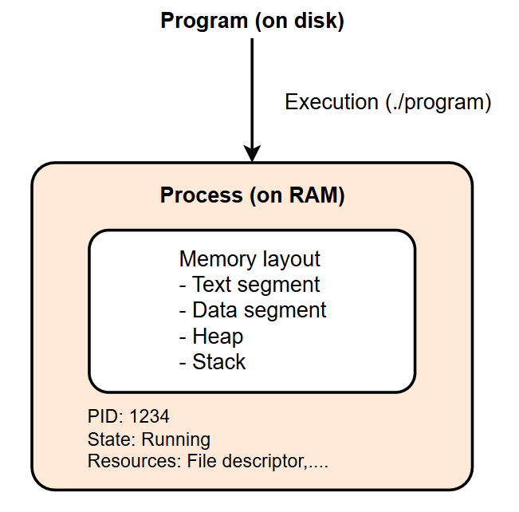
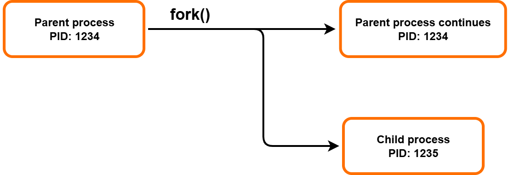
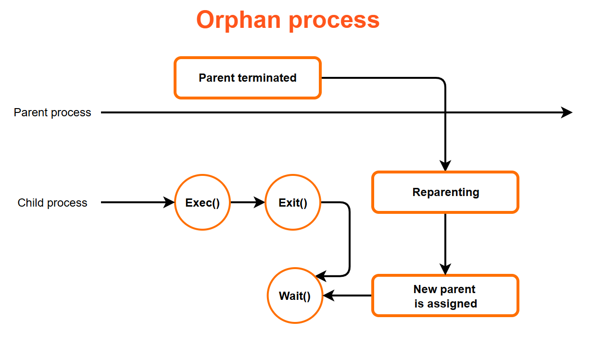
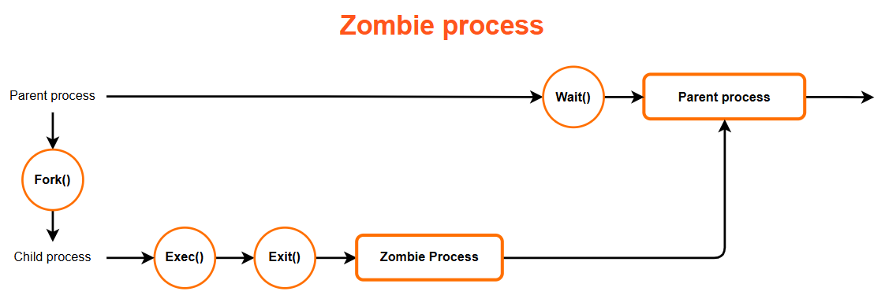

# Embedded Linux - Linux Process

> Tài liệu học về Linux Process: Program vs Process, Command-line Arguments, Memory Layout, Process Operations và Process Management

---

## 📑 Mục Lục

### [1. Introduction](#1-introduction)
- [1.1. Program và Process](#11-program-và-process)

### [2. Command-line Argument](#2-command-line-argument)
- [2.1. Command-line Argument là gì?](#21-command-line-argument-là-gì)
- [2.2. Ví dụ minh họa](#22-ví-dụ-minh-họa)

### [3. Memory Layout](#3-memory-layout)
- [3.1. Tổng quan Memory Layout](#31-tổng-quan-memory-layout)
- [3.2. Text Segment](#32-text-segment)
- [3.3. Initialized Data Segment](#33-initialized-data-segment)
- [3.4. Uninitialized Data Segment (BSS)](#34-uninitialized-data-segment-bss)
- [3.5. Heap Segment](#35-heap-segment)
- [3.6. Stack Segment](#36-stack-segment)

### [4. Operations on Process](#4-operations-on-process)
- [4.1. System call fork()](#41-system-call-fork)
- [4.2. Exec Family](#42-exec-family)
- [4.3. Process Termination](#43-process-termination)
- [4.4. Ví dụ tổng hợp](#44-ví-dụ-tổng-hợp)

### [5. Process Management](#5-process-management)
- [5.1. Tổng quan Process Management](#51-tổng-quan-process-management)
- [5.2. System call wait()](#52-system-call-wait)
- [5.3. System call waitpid()](#53-system-call-waitpid)

### [6. Orphan và Zombie Process](#6-orphan-và-zombie-process)
- [6.1. Orphan Process](#61-orphan-process)
- [6.2. Zombie Process](#62-zombie-process)
- [6.3. Cách phòng tránh Zombie Process](#63-cách-phòng-tránh-zombie-process)

---

# 1. Introduction

## 1.1. Program và Process

### Program là gì?

**Program** (Chương trình) là một tập hợp các chỉ thị (instructions) được viết bằng ngôn ngữ lập trình, được lưu trữ dưới dạng file thực thi trên ổ đĩa.

```
Program Characteristics:
├── Passive entity (thực thể thụ động)
├── Stored on disk as executable file
├── Contains machine code instructions
├── Contains initialized data
└── Does NOT consume CPU or memory (when not running)
```

**Ví dụ:**
```bash
# Xem file executable
ls -l /bin/ls
# -rwxr-xr-x 1 root root 142144 ... /bin/ls

# File /bin/ls là một program
file /bin/ls
# /bin/ls: ELF 64-bit LSB pie executable...
```

### Process là gì?

**Process** (Tiến trình) là một instance của program đang được thực thi. Khi một program được load vào memory và bắt đầu chạy, nó trở thành một process.

```
Process Characteristics:
├── Active entity (thực thể hoạt động)
├── Loaded into memory (RAM)
├── Has its own memory space
├── Has Process ID (PID)
├── Consumes CPU time and memory
├── Has associated resources (file descriptors, etc.)
└── Has a lifecycle (created, running, terminated)
```

### So sánh Program vs Process:

| Đặc điểm              | Program               | Process                               |
| --------------------- | --------------------- | ------------------------------------- |
| **Trạng thái**        | Thụ động (passive)    | Hoạt động (active)                    |
| **Vị trí**            | Trên ổ đĩa            | Trong bộ nhớ (RAM)                    |
| **Tài nguyên**        | Không tiêu thụ        | Tiêu thụ CPU, RAM                     |
| **Định danh**         | Filename              | PID (Process ID)                      |
| **Số lượng**          | 1 file                | Nhiều instances có thể chạy đồng thời |
| **Thời gian tồn tại** | Vĩnh viễn (trên disk) | Tạm thời (khi đang chạy)              |

### Process ID (PID):

Mỗi process được kernel gán một số định danh duy nhất gọi là **PID**.

```bash
# Xem PID của shell hiện tại
echo $$
# Output: 1234

# Xem danh sách processes
ps aux
# USER  PID %CPU %MEM    VSZ   RSS TTY STAT START   TIME COMMAND
# root    1  0.0  0.1 169536 13312 ?   Ss   10:00   0:01 /sbin/init
# user 1234  0.0  0.0  10036  3456 pts/0 Ss 10:01   0:00 bash

# Xem process tree
pstree -p
```

**Trong C code:**
```c
#include <unistd.h>
#include <stdio.h>

int main() {
    pid_t pid = getpid();   // Lấy PID của process hiện tại
    pid_t ppid = getppid(); // Lấy PID của parent process
    
    printf("My PID: %d\n", pid);
    printf("Parent PID: %d\n", ppid);
    
    return 0;
}
```

### Mối quan hệ giữa Program và Process:



---

# 2. Command-line Argument

## 2.1. Command-line Argument là gì?

**Command-line arguments** là các tham số được truyền vào program khi thực thi từ terminal. Đây là cách phổ biến để cung cấp input cho program mà không cần hardcode giá trị.

### Cú pháp trong C:

```c
int main(int argc, char *argv[])
```

| Parameter | Ý nghĩa                                                          |
| --------- | ---------------------------------------------------------------- |
| `argc`    | **Argument Count** - Số lượng arguments (bao gồm cả tên program) |
| `argv`    | **Argument Vector** - Mảng con trỏ chứa các argument strings     |

### Cấu trúc argv:

```
Command: ./program hello world 123

argv[0] = "./program"    # Tên program
argv[1] = "hello"        # Argument đầu tiên
argv[2] = "world"        # Argument thứ hai
argv[3] = "123"          # Argument thứ ba
argv[4] = NULL           # Luôn kết thúc bằng NULL

argc = 4
```

### Quy tắc quan trọng:

1. **`argv[0]`** luôn là tên program được gọi
2. **`argc`** luôn >= 1 (ít nhất có tên program)
3. **`argv[argc]`** luôn bằng `NULL`
4. Tất cả arguments đều là **strings** (char*)

## 2.2. Ví dụ minh họa

### Ví dụ 1: In tất cả arguments

```c
#include <stdio.h>

int main(int argc, char *argv[]) {
    printf("Number of arguments: %d\n", argc);
    
    for (int i = 0; i < argc; i++) {
        printf("argv[%d] = \"%s\"\n", i, argv[i]);
    }
    
    return 0;
}
```

**Chạy program:**
```bash
$ ./print_args hello world 123
Number of arguments: 4
argv[0] = "./print_args"
argv[1] = "hello"
argv[2] = "world"
argv[3] = "123"
```

### Ví dụ 2: Chuyển đổi argument thành số

```c
#include <stdio.h>
#include <stdlib.h>

int main(int argc, char *argv[]) {
    if (argc != 3) {
        fprintf(stderr, "Usage: %s <num1> <num2>\n", argv[0]);
        return 1;
    }
    
    // Chuyển đổi string thành integer
    int num1 = atoi(argv[1]);
    int num2 = atoi(argv[2]);
    
    printf("%d + %d = %d\n", num1, num2, num1 + num2);
    
    return 0;
}
```

**Chạy program:**
```bash
$ ./add 10 20
10 + 20 = 30

$ ./add 5
Usage: ./add <num1> <num2>
```

### Ví dụ 3: File copy program với arguments

```c
#include <stdio.h>
#include <fcntl.h>
#include <unistd.h>

#define BUFFER_SIZE 4096

int main(int argc, char *argv[]) {
    if (argc != 3) {
        fprintf(stderr, "Usage: %s <source> <destination>\n", argv[0]);
        return 1;
    }
    
    const char *src_file = argv[1];
    const char *dst_file = argv[2];
    
    int src_fd = open(src_file, O_RDONLY);
    if (src_fd == -1) {
        perror("Error opening source file");
        return 1;
    }
    
    int dst_fd = open(dst_file, O_WRONLY | O_CREAT | O_TRUNC, 0644);
    if (dst_fd == -1) {
        perror("Error creating destination file");
        close(src_fd);
        return 1;
    }
    
    char buffer[BUFFER_SIZE];
    ssize_t bytes_read;
    
    while ((bytes_read = read(src_fd, buffer, BUFFER_SIZE)) > 0) {
        write(dst_fd, buffer, bytes_read);
    }
    
    close(src_fd);
    close(dst_fd);
    
    printf("File copied: %s -> %s\n", src_file, dst_file);
    return 0;
}
```

### Biến môi trường (Environment Variables):

Ngoài `argc` và `argv`, còn có cách khác để truy cập environment variables:

```c
#include <stdio.h>
#include <stdlib.h>

// Cách 1: Sử dụng tham số thứ 3 của main
int main(int argc, char *argv[], char *envp[]) {
    // In một số environment variables
    for (int i = 0; envp[i] != NULL; i++) {
        printf("%s\n", envp[i]);
    }
    return 0;
}

// Cách 2: Sử dụng getenv()
int main() {
    char *home = getenv("HOME");
    char *path = getenv("PATH");
    
    printf("HOME: %s\n", home);
    printf("PATH: %s\n", path);
    
    return 0;
}
```

---

# 3. Memory Layout

## 3.1. Tổng quan Memory Layout

Khi một program được thực thi và trở thành process, hệ điều hành cấp phát một vùng nhớ ảo (virtual memory) cho process đó. Vùng nhớ này được chia thành các segment khác nhau.

```
High Address
┌─────────────────────────────┐ 0xFFFFFFFF (32-bit)
│                             │
│      Command-line args      │
│      Environment variables  │
├─────────────────────────────┤
│                             │
│          STACK              │  ← Grows downward
│      (local variables,      │
│       function calls)       │
│             ↓               │
├─────────────────────────────┤
│             ↕               │
│    (unused/unmapped space)  │
│             ↕               │
├─────────────────────────────┤
│             ↑               │
│           HEAP              │  ← Grows upward
│    (dynamic allocation:     │
│     malloc, calloc, etc.)   │
│                             │
├─────────────────────────────┤
│                             │
│    BSS (Uninitialized       │
│         Data Segment)       │
│                             │
├─────────────────────────────┤
│                             │
│    DATA (Initialized        │
│          Data Segment)      │
│                             │
├─────────────────────────────┤
│                             │
│    TEXT (Code Segment)      │
│    (program instructions)   │
│                             │
└─────────────────────────────┘ 0x00000000
Low Address
```

### Tổng quan các segment:

| Segment   | Nội dung                              | Đặc điểm                     |
| --------- | ------------------------------------- | ---------------------------- |
| **Text**  | Machine code (instructions)           | Read-only, shared            |
| **Data**  | Initialized global/static variables   | Read-write                   |
| **BSS**   | Uninitialized global/static variables | Read-write, zero-initialized |
| **Heap**  | Dynamic memory (malloc)               | Grows upward                 |
| **Stack** | Local variables, function calls       | Grows downward               |

## 3.2. Text Segment

**Text segment** (Code segment) chứa mã máy (machine code) của program - các instructions mà CPU sẽ thực thi.

### Đặc điểm:
- **Read-only**: Ngăn chặn việc vô tình hoặc cố ý sửa đổi code
- **Sharable**: Nhiều instances của cùng program có thể share text segment
- **Kích thước cố định**: Được xác định tại compile time

```c
// Tất cả code trong file .c sẽ nằm trong Text segment
int add(int a, int b) {    // Function code → Text segment
    return a + b;
}

int main() {               // Main function code → Text segment
    int result = add(5, 3);
    return 0;
}
```

## 3.3. Initialized Data Segment

**Initialized Data segment** (Data segment) chứa các biến global và static đã được khởi tạo giá trị tại compile time.

### Đặc điểm:
- **Read-write**: Có thể thay đổi giá trị trong runtime
- **Khởi tạo rõ ràng**: Chứa giá trị ban đầu được chỉ định trong code

```c
// Initialized global variables → Data segment
int global_var = 100;
char message[] = "Hello, World!";
float pi = 3.14159;

// Initialized static variables → Data segment
static int static_var = 50;

int main() {
    // Initialized static local → Data segment
    static int counter = 0;
    counter++;
    
    return 0;
}
```

## 3.4. Uninitialized Data Segment (BSS)

**BSS** (Block Started by Symbol) chứa các biến global và static chưa được khởi tạo hoặc được khởi tạo bằng 0.

### Đặc điểm:
- **Zero-initialized**: Kernel tự động set về 0 khi process start
- **Không chiếm dung lượng trong executable**: Chỉ lưu kích thước cần thiết
- **Read-write**: Có thể thay đổi trong runtime

```c
// Uninitialized global → BSS segment
int uninitialized_global;          // = 0
char buffer[1024];                 // All zeros
static double static_double;       // = 0.0

// Explicitly zero-initialized → BSS segment
int zero_var = 0;

int main() {
    // Uninitialized static local → BSS segment
    static int static_local;       // = 0
    
    printf("uninitialized_global = %d\n", uninitialized_global);  // 0
    return 0;
}
```

## 3.5. Heap Segment

**Heap segment** là vùng nhớ dùng cho dynamic memory allocation (cấp phát bộ nhớ động).

### Đặc điểm:
- **Grows upward**: Mở rộng về phía địa chỉ cao hơn
- **Manual management**: Programmer phải tự quản lý (malloc/free)
- **Flexible size**: Kích thước thay đổi trong runtime

### Các hàm quản lý Heap:

| Function    | Prototype                               | Mô tả                  |
| ----------- | --------------------------------------- | ---------------------- |
| `malloc()`  | `void *malloc(size_t size)`             | Cấp phát vùng nhớ      |
| `calloc()`  | `void *calloc(size_t n, size_t size)`   | Cấp phát và khởi tạo 0 |
| `realloc()` | `void *realloc(void *ptr, size_t size)` | Thay đổi kích thước    |
| `free()`    | `void free(void *ptr)`                  | Giải phóng bộ nhớ      |

```c
#include <stdlib.h>
#include <stdio.h>
#include <string.h>

int main() {
    // Cấp phát mảng 10 integers trên heap
    int *arr = (int *)malloc(10 * sizeof(int));
    if (arr == NULL) {
        perror("malloc failed");
        return 1;
    }
    
    // Sử dụng bộ nhớ
    for (int i = 0; i < 10; i++) {
        arr[i] = i * 10;
    }
    
    // Mở rộng mảng thành 20 integers
    arr = (int *)realloc(arr, 20 * sizeof(int));
    
    // Cấp phát với calloc (zero-initialized)
    char *buffer = (char *)calloc(100, sizeof(char));
    strcpy(buffer, "Hello Heap!");
    
    // QUAN TRỌNG: Giải phóng bộ nhớ
    free(arr);
    free(buffer);
    
    return 0;
}
```

### Memory Leak:

```c
// ❌ Memory leak - không free
void bad_function() {
    int *ptr = malloc(100);
    // Quên free(ptr) → Memory leak!
}

// ✅ Correctly freed
void good_function() {
    int *ptr = malloc(100);
    // ... sử dụng ptr ...
    free(ptr);
}
```

## 3.6. Stack Segment

**Stack segment** chứa các biến local, tham số hàm, và thông tin về function calls.

### Đặc điểm:
- **Grows downward**: Mở rộng về phía địa chỉ thấp hơn
- **LIFO**: Last-In-First-Out structure
- **Automatic management**: Tự động cấp phát/giải phóng
- **Limited size**: Có giới hạn (thường 8MB trên Linux)

### Nội dung trên Stack:
- Local variables
- Function parameters
- Return addresses
- Saved registers (stack frame)

```c
#include <stdio.h>

void function_b(int param) {
    int local_b = 30;    // Stack: local variable
    printf("In function_b: local_b = %d\n", local_b);
}

void function_a(int x) {
    int local_a = 20;    // Stack: local variable
    function_b(local_a); // Stack: param, return address
}

int main() {
    int local_main = 10; // Stack: local variable
    function_a(local_main);
    return 0;
}
```

### Stack trong Memory:

```
High Address
┌───────────────────────┐
│  main() stack frame   │
│  - local_main = 10    │
│  - return address     │
├───────────────────────┤
│  function_a() frame   │
│  - x = 10             │
│  - local_a = 20       │
│  - return address     │
├───────────────────────┤
│  function_b() frame   │
│  - param = 20         │
│  - local_b = 30       │ ← Stack Pointer (SP)
└───────────────────────┘
Low Address
```

### Stack Overflow:

```c
// ❌ Stack overflow - recursion không có điều kiện dừng
void infinite_recursion() {
    int big_array[10000];  // 40KB mỗi lần gọi
    infinite_recursion();   // Stack overflow!
}

// Kiểm tra stack limit
// $ ulimit -s
// 8192  (8MB default)
```

### Xem Memory Layout của Process:

```bash
# Xem memory map của process
cat /proc/<PID>/maps

# Hoặc sử dụng pmap
pmap <PID>

# Trong C code
size ./program  # Xem segment sizes
```

---

# 4. Operations on Process

## 4.1. System call fork()

**`fork()`** là system call để tạo một process mới (child process) bằng cách sao chép process hiện tại (parent process).

### Prototype:

```c
#include <unistd.h>

pid_t fork(void);
```

### Return value:
- **Trong parent process**: Trả về PID của child process (> 0)
- **Trong child process**: Trả về 0
- **Nếu lỗi**: Trả về -1

### Đặc điểm của fork():
1. Child process là **bản sao** của parent process
2. Child có **địa chỉ bộ nhớ riêng** (copy-on-write)
3. Child kế thừa: file descriptors, environment, signals...
4. Child có **PID riêng**, PPID = PID của parent

```c
#include <stdio.h>
#include <unistd.h>
#include <sys/types.h>

int main() {
    printf("Before fork: PID = %d\n", getpid());
    
    pid_t pid = fork();
    
    if (pid < 0) {
        // Fork failed
        perror("fork failed");
        return 1;
    } 
    else if (pid == 0) {
        // Child process
        printf("Child: My PID = %d, Parent PID = %d\n", 
               getpid(), getppid());
    } 
    else {
        // Parent process
        printf("Parent: My PID = %d, Child PID = %d\n", 
               getpid(), pid);
    }
    
    printf("This line is executed by PID %d\n", getpid());
    
    return 0;
}
```

**Output mẫu:**
```
Before fork: PID = 1234
Parent: My PID = 1234, Child PID = 1235
This line is executed by PID 1234
Child: My PID = 1235, Parent PID = 1234
This line is executed by PID 1235
```

### Fork Diagram:



## 4.2. Exec Family

**Exec family** là nhóm system calls dùng để thay thế process image hiện tại bằng một program mới.

### Các hàm trong exec family:

| Function   | Đặc điểm                                                   |
| ---------- | ---------------------------------------------------------- |
| `execl()`  | List arguments, path đầy đủ                                |
| `execlp()` | List arguments, tìm trong PATH                             |
| `execle()` | List arguments, custom environment                         |
| `execv()`  | Vector (array) arguments, path đầy đủ                      |
| `execvp()` | Vector arguments, tìm trong PATH                           |
| `execve()` | Vector arguments, custom environment (system call thực sự) |

### Prototype:

```c
#include <unistd.h>

int execl(const char *path, const char *arg0, ..., NULL);
int execlp(const char *file, const char *arg0, ..., NULL);
int execv(const char *path, char *const argv[]);
int execvp(const char *file, char *const argv[]);
int execve(const char *path, char *const argv[], char *const envp[]);
```

### Đặc điểm quan trọng:
1. **Không tạo process mới** - thay thế process hiện tại
2. **PID không đổi** sau khi exec
3. **Không return** nếu thành công
4. Chỉ return **-1** nếu có lỗi

### Ví dụ:

```c
#include <stdio.h>
#include <unistd.h>

int main() {
    printf("Before exec, PID = %d\n", getpid());
    
    // Cách 1: execl - list arguments
    // execl("/bin/ls", "ls", "-l", "-a", NULL);
    
    // Cách 2: execlp - tìm trong PATH
    // execlp("ls", "ls", "-l", NULL);
    
    // Cách 3: execv - array arguments
    char *args[] = {"ls", "-l", "-a", NULL};
    execv("/bin/ls", args);
    
    // Chỉ chạy đến đây nếu exec thất bại
    perror("exec failed");
    return 1;
}
```

### Fork + Exec Pattern:

Kết hợp `fork()` và `exec()` là pattern phổ biến để chạy một program mới:

```c
#include <stdio.h>
#include <unistd.h>
#include <sys/wait.h>

int main() {
    pid_t pid = fork();
    
    if (pid == 0) {
        // Child: thay thế bằng program mới
        execlp("ls", "ls", "-la", NULL);
        perror("exec failed");
        _exit(1);
    } 
    else if (pid > 0) {
        // Parent: đợi child kết thúc
        int status;
        waitpid(pid, &status, 0);
        printf("Child exited with status %d\n", WEXITSTATUS(status));
    }
    
    return 0;
}
```

## 4.3. Process Termination

Process có thể kết thúc theo nhiều cách:

### Normal Termination (Kết thúc bình thường):

| Cách               | Mô tả                                          |
| ------------------ | ---------------------------------------------- |
| `return` từ main() | Return value là exit status                    |
| `exit(status)`     | Clean exit, gọi atexit handlers, flush buffers |
| `_exit(status)`    | Immediate exit, không cleanup                  |
| `_Exit(status)`    | Giống _exit()                                  |

### Abnormal Termination (Kết thúc bất thường):

| Cách      | Mô tả                        |
| --------- | ---------------------------- |
| Signal    | SIGKILL, SIGSEGV, SIGTERM... |
| `abort()` | Gửi SIGABRT đến chính mình   |

### Exit Status:

```c
#include <stdio.h>
#include <stdlib.h>

void cleanup() {
    printf("Cleanup function called\n");
}

int main() {
    // Đăng ký cleanup function
    atexit(cleanup);
    
    // exit() sẽ gọi cleanup
    exit(0);
    
    // Hoặc return từ main
    // return 0;  // Tương đương exit(0)
}
```

```bash
# Kiểm tra exit status
./program
echo $?  # In exit status của command trước đó
```

## 4.4. Ví dụ tổng hợp

### Ví dụ: Simple Shell

```c
#include <stdio.h>
#include <stdlib.h>
#include <string.h>
#include <unistd.h>
#include <sys/wait.h>

#define MAX_LINE 256
#define MAX_ARGS 64

int main() {
    char line[MAX_LINE];
    char *args[MAX_ARGS];
    
    while (1) {
        // Hiển thị prompt
        printf("myshell> ");
        fflush(stdout);
        
        // Đọc command
        if (fgets(line, MAX_LINE, stdin) == NULL) {
            break;  // EOF
        }
        
        // Loại bỏ newline
        line[strcspn(line, "\n")] = '\0';
        
        // Kiểm tra lệnh exit
        if (strcmp(line, "exit") == 0) {
            break;
        }
        
        // Tokenize command
        int argc = 0;
        char *token = strtok(line, " ");
        while (token != NULL && argc < MAX_ARGS - 1) {
            args[argc++] = token;
            token = strtok(NULL, " ");
        }
        args[argc] = NULL;
        
        if (argc == 0) continue;
        
        // Fork và exec
        pid_t pid = fork();
        
        if (pid == 0) {
            // Child process
            execvp(args[0], args);
            perror("Command not found");
            _exit(1);
        } 
        else if (pid > 0) {
            // Parent: wait for child
            int status;
            waitpid(pid, &status, 0);
        } 
        else {
            perror("fork failed");
        }
    }
    
    printf("Goodbye!\n");
    return 0;
}
```

---

# 5. Process Management

## 5.1. Tổng quan Process Management

### Process Management là gì?

**Process Management** là việc kiểm soát và điều phối các process trong hệ thống. Đây là một trong những nhiệm vụ quan trọng nhất của hệ điều hành, đảm bảo các process hoạt động hiệu quả, không xung đột và sử dụng tài nguyên hợp lý.

### Các thành phần chính của Process Management

Linux kernel quản lý process thông qua các hoạt động sau:

| Thành phần                | Mô tả                                     | Ví dụ                           |
| ------------------------- | ----------------------------------------- | ------------------------------- |
| **Tạo process**           | Sinh ra process mới từ process hiện tại   | `fork()`, `exec()`              |
| **Lập lịch (Scheduling)** | Phân chia CPU time cho các process        | CFS (Completely Fair Scheduler) |
| **Đồng bộ hóa**           | Điều phối truy cập tài nguyên dùng chung  | Mutex, Semaphore                |
| **Giao tiếp (IPC)**       | Cho phép các process trao đổi dữ liệu     | Pipe, Shared Memory, Signal     |
| **Kết thúc process**      | Thu hồi tài nguyên khi process hoàn thành | `exit()`, `wait()`              |

### Process States (Trạng thái của Process)

Trong vòng đời của mình, một process sẽ chuyển qua nhiều trạng thái khác nhau:

```
                    ┌─────────────┐
        fork()      │   Created   │
    ───────────────►│   (New)     │
                    └──────┬──────┘
                           │
                           ▼
                    ┌─────────────┐
                    │    Ready    │◄──────────┐
                    │  (Runnable) │           │
                    └──────┬──────┘           │
                           │                  │
              schedule     │                  │ I/O complete
                           ▼                  │ or event
                    ┌─────────────┐           │
                    │   Running   │───────────┤
                    │             │           │
                    └──────┬──────┘           │
                           │                  │
                           │ I/O wait         │
                           ▼                  │
                    ┌─────────────┐           │
                    │   Waiting   │───────────┘
                    │  (Blocked)  │
                    └──────┬──────┘
                           │
                           │ exit
                           ▼
                    ┌─────────────┐
                    │  Terminated │
                    │   (Zombie)  │
                    └─────────────┘
```

**Giải thích các trạng thái:**

| Trạng thái              | Ký hiệu | Mô tả                                                            |
| ----------------------- | ------- | ---------------------------------------------------------------- |
| **Created (New)**       | -       | Process vừa được tạo bởi `fork()`, đang trong giai đoạn khởi tạo |
| **Ready (Runnable)**    | R       | Sẵn sàng chạy, đang chờ được scheduler cấp CPU                   |
| **Running**             | R       | Đang thực thi trên CPU                                           |
| **Waiting (Blocked)**   | S/D     | Đang chờ I/O (đọc file, network) hoặc sự kiện nào đó             |
| **Terminated (Zombie)** | Z       | Đã kết thúc, đang chờ parent gọi `wait()` để thu hồi             |

### Xem Process States trên Linux

Sử dụng lệnh `ps` để xem trạng thái các process:

```bash
# Xem tất cả process với thông tin chi tiết
ps aux

# Output mẫu:
# USER  PID %CPU %MEM   VSZ   RSS TTY   STAT START  TIME COMMAND
# root    1  0.0  0.1 169536 13312 ?     Ss   10:00  0:01 /sbin/init
# user 1234  0.0  0.0  10036  3456 pts/0 R+   10:01  0:00 ls -la
```

**Ý nghĩa cột STAT (Status):**

| Ký hiệu | Trạng thái | Mô tả                                         |
| ------- | ---------- | --------------------------------------------- |
| `R`     | Running    | Đang chạy hoặc trong run queue                |
| `S`     | Sleeping   | Đang ngủ, có thể được đánh thức bởi signal    |
| `D`     | Disk sleep | Đang ngủ sâu (uninterruptible), thường là I/O |
| `T`     | Stopped    | Bị dừng bởi signal (SIGSTOP, SIGTSTP)         |
| `Z`     | Zombie     | Đã kết thúc nhưng chưa được parent thu hồi    |

**Các ký tự bổ sung:**

| Ký hiệu | Ý nghĩa                        |
| ------- | ------------------------------ |
| `<`     | High-priority (nice value < 0) |
| `N`     | Low-priority (nice value > 0)  |
| `s`     | Session leader                 |
| `l`     | Multi-threaded                 |
| `+`     | Foreground process group       |

**Các lệnh hữu ích khác:**

```bash
# Xem process theo dạng cây
pstree -p

# Xem thông tin chi tiết về một process cụ thể
cat /proc/<PID>/status

# Monitor process theo thời gian thực
top
htop
```

## 5.2. System call wait()

**`wait()`** cho phép parent process đợi child process kết thúc và thu thập exit status.
- Tại thời điểm wait() được gọi, hàm sẽ chặn (block) cho đến khi một tiến trình con kết thúc.
- Nếu tồn tại tiến trình con đã kết thúc trước thời điểm gọi wait(), hàm sẽ trả về ngay lập tức.
- Nếu giá trị trạng thái khác -1, tham số status sẽ trỏ đến một giá trị kiểu số nguyên, chứa thông tin về trạng thái kết thúc của tiến trình.
  
### Prototype:

```c
#include <sys/wait.h>

pid_t wait(int *status);
```

### Return value:
- **Thành công**: PID của child đã terminated
- **Lỗi**: -1

### Macros để kiểm tra status:

| Macro                 | Ý nghĩa                           |
| --------------------- | --------------------------------- |
| `WIFEXITED(status)`   | True nếu child exit bình thường   |
| `WEXITSTATUS(status)` | Exit code của child (0-255)       |
| `WIFSIGNALED(status)` | True nếu child bị kill bởi signal |
| `WTERMSIG(status)`    | Signal number đã kill child       |
| `WIFSTOPPED(status)`  | True nếu child bị stopped         |
| `WSTOPSIG(status)`    | Signal đã stop child              |

### Ví dụ:

```c
#include <stdio.h>
#include <stdlib.h>
#include <unistd.h>
#include <sys/wait.h>

int main() {
    pid_t pid = fork();
    
    if (pid == 0) {
        // Child process
        printf("Child: doing some work...\n");
        sleep(2);
        printf("Child: exiting with status 42\n");
        exit(42);
    } 
    else {
        // Parent process
        int status;
        pid_t terminated_pid = wait(&status);
        
        printf("Parent: child %d terminated\n", terminated_pid);
        
        if (WIFEXITED(status)) {
            printf("Exit status: %d\n", WEXITSTATUS(status));
        }
        
        if (WIFSIGNALED(status)) {
            printf("Killed by signal: %d\n", WTERMSIG(status));
        }
    }
    
    return 0;
}
```

## 5.3. System call waitpid()

**`waitpid()`** linh hoạt hơn `wait()`, cho phép đợi một child cụ thể và có các options bổ sung.

### Prototype:

```c
#include <sys/wait.h>

pid_t waitpid(pid_t pid, int *status, int options);
```

### Parameters:

| pid value | Ý nghĩa                                            |
| --------- | -------------------------------------------------- |
| `> 0`     | Đợi child với PID cụ thể                           |
| `-1`      | Đợi bất kỳ child nào (giống wait())                |
| `0`       | Đợi bất kỳ child nào trong cùng process group      |
| `< -1`    | Đợi bất kỳ child nào trong process group = \|pid\| |

### Options:

| Option      | Ý nghĩa                                          |
| ----------- | ------------------------------------------------ |
| `0`         | Block cho đến khi child terminate                |
| `WNOHANG`   | Return ngay lập tức nếu không có child terminate |
| `WUNTRACED` | Cũng return nếu child bị stopped                 |

### Ví dụ:

```c
#include <stdio.h>
#include <stdlib.h>
#include <unistd.h>
#include <sys/wait.h>

int main() {
    pid_t child1, child2;
    
    // Tạo child 1
    child1 = fork();
    if (child1 == 0) {
        sleep(3);
        exit(1);
    }
    
    // Tạo child 2
    child2 = fork();
    if (child2 == 0) {
        sleep(1);
        exit(2);
    }
    
    // Parent: đợi child cụ thể
    int status;
    
    // Đợi child2 trước
    printf("Waiting for child2 (PID %d)...\n", child2);
    waitpid(child2, &status, 0);
    printf("Child2 exited with %d\n", WEXITSTATUS(status));
    
    // Đợi child1
    printf("Waiting for child1 (PID %d)...\n", child1);
    waitpid(child1, &status, 0);
    printf("Child1 exited with %d\n", WEXITSTATUS(status));
    
    return 0;
}
```

### Non-blocking wait với WNOHANG:

```c
#include <stdio.h>
#include <stdlib.h>
#include <unistd.h>
#include <sys/wait.h>

int main() {
    pid_t pid = fork();
    
    if (pid == 0) {
        sleep(5);
        exit(0);
    }
    
    // Parent: polling với WNOHANG
    int status;
    pid_t result;
    
    while (1) {
        result = waitpid(pid, &status, WNOHANG);
        
        if (result == 0) {
            printf("Child still running, doing other work...\n");
            sleep(1);
        } 
        else if (result == pid) {
            printf("Child exited with status %d\n", WEXITSTATUS(status));
            break;
        } 
        else {
            perror("waitpid error");
            break;
        }
    }
    
    return 0;
}
```

---

# 6. Orphan và Zombie Process

## 6.1. Orphan Process



**Orphan Process** là process mà parent đã terminate trước khi nó kết thúc.

### Đặc điểm:
- **Được "nhận nuôi"** bởi init process (PID 1) hoặc systemd
- **PPID thay đổi** thành 1
- **Không gây hại** - được system quản lý bình thường
- Init sẽ **tự động wait()** cho orphan khi nó terminate

```c
#include <stdio.h>
#include <unistd.h>
#include <sys/types.h>

int main() {
    pid_t pid = fork();
    
    if (pid == 0) {
        // Child process
        printf("Child: PID = %d, PPID = %d\n", getpid(), getppid());
        
        sleep(10);  // Parent sẽ exit trong lúc này
        
        // Sau khi parent exit, PPID thay đổi thành 1
        printf("Child: PID = %d, PPID = %d (orphaned!)\n", 
               getpid(), getppid());
    } 
    else {
        // Parent process - exit ngay lập tức
        printf("Parent: exiting, child PID = %d\n", pid);
        sleep(2);
        // Parent exits, không wait cho child
    }
    
    return 0;
}
```

```bash
# Chạy và quan sát
./orphan &
ps -ef | grep orphan
# Sau khi parent exit, child có PPID = 1
```

## 6.2. Zombie Process



**Zombie Process** (defunct process) là process đã terminate nhưng parent chưa gọi wait() để thu thập exit status.

### Đặc điểm:
- **Đã kết thúc** - không chiếm CPU
- **Vẫn tồn tại trong process table** - chiếm PID và một ít memory
- **State: Z** (zombie) trong ps output
- Hiển thị là `<defunct>` trong ps
- **Tích lũy zombie** có thể cạn kiệt process table

### Tại sao cần zombie?
- Kernel cần giữ exit status cho parent
- Parent cần biết child đã exit như thế nào

```c
#include <stdio.h>
#include <unistd.h>
#include <stdlib.h>

int main() {
    pid_t pid = fork();
    
    if (pid == 0) {
        // Child: exit ngay
        printf("Child: exiting...\n");
        exit(0);
    } 
    else {
        // Parent: KHÔNG gọi wait()
        printf("Parent: created child %d, sleeping...\n", pid);
        sleep(60);  // Trong 60s, child là zombie
        
        // Child thành zombie trong thời gian này
        // ps aux | grep Z
    }
    
    return 0;
}
```

```bash
# Kiểm tra zombie
ps aux | grep Z
# user  1235  0.0  0.0  0  0 pts/0 Z  ... [program] <defunct>
```

## 6.3. Cách phòng tránh Zombie Process

Mỗi hệ thống đều có một bảng định danh tiến trình (PID table). Kích thước của bảng này là hữu hạn.

Quá nhiều zombie process → bảng này sẽ bị lấp đầy → hệ thống sẽ không thể tạo thêm bất kỳ tiến trình mới nào.

### Cách 1: Luôn gọi wait()/waitpid()

```c
#include <stdio.h>
#include <stdlib.h>
#include <unistd.h>
#include <sys/wait.h>

int main() {
    pid_t pid = fork();
    
    if (pid == 0) {
        printf("Child doing work...\n");
        exit(0);
    } else {
        // ✅ Luôn wait cho child
        int status;
        wait(&status);
        printf("Child reaped, status: %d\n", WEXITSTATUS(status));
    }
    
    return 0;
}
```

### Cách 2: Sử dụng signal handler cho SIGCHLD

```c
#include <stdio.h>
#include <stdlib.h>
#include <unistd.h>
#include <signal.h>
#include <sys/wait.h>

// Signal handler để reap zombie children
void sigchld_handler(int sig) {
    // Reap tất cả terminated children
    while (waitpid(-1, NULL, WNOHANG) > 0);
}

int main() {
    // Đăng ký handler cho SIGCHLD
    signal(SIGCHLD, sigchld_handler);
    
    for (int i = 0; i < 5; i++) {
        pid_t pid = fork();
        if (pid == 0) {
            printf("Child %d working...\n", getpid());
            sleep(i + 1);
            exit(i);
        }
    }
    
    // Parent tiếp tục công việc khác
    printf("Parent doing other work...\n");
    sleep(10);
    
    return 0;
}
```

### Cách 3: Double fork (daemon pattern)

```c
#include <stdio.h>
#include <stdlib.h>
#include <unistd.h>
#include <sys/wait.h>

int main() {
    pid_t pid1 = fork();
    
    if (pid1 == 0) {
        // First child
        pid_t pid2 = fork();
        
        if (pid2 == 0) {
            // Grandchild - sẽ được init nhận nuôi
            sleep(5);
            printf("Grandchild: doing long work, PPID = %d\n", getppid());
            exit(0);
        }
        
        // First child exits ngay lập tức
        exit(0);
    }
    
    // Parent: wait for first child only
    wait(NULL);
    printf("Parent: first child reaped\n");
    
    // Parent có thể tiếp tục mà không lo zombie
    // Grandchild được init quản lý
    
    return 0;
}
```

### Cách 4: Ignore SIGCHLD

```c
#include <signal.h>

int main() {
    // Ignore SIGCHLD - kernel tự động reap children
    signal(SIGCHLD, SIG_IGN);
    
    pid_t pid = fork();
    if (pid == 0) {
        exit(0);  // Child exits, không thành zombie
    }
    
    // Parent không cần wait
    sleep(60);
    
    return 0;
}
```

### Tổng kết cách xử lý:

| Phương pháp        | Ưu điểm                        | Nhược điểm                |
| ------------------ | ------------------------------ | ------------------------- |
| `wait()/waitpid()` | Đơn giản, lấy được exit status | Parent bị block           |
| SIGCHLD handler    | Non-blocking                   | Phức tạp hơn              |
| Double fork        | Tách biệt hoàn toàn            | Phức tạp, mất exit status |
| `SIG_IGN`          | Đơn giản nhất                  | Mất hoàn toàn exit status |

---

## 📚 Tài liệu tham khảo

- *The Linux Programming Interface* - Michael Kerrisk
- *Advanced Programming in the UNIX Environment* - W. Richard Stevens
- Linux man pages: `man fork`, `man exec`, `man wait`
- [Linux Process Management](https://www.kernel.org/doc/html/latest/admin-guide/)